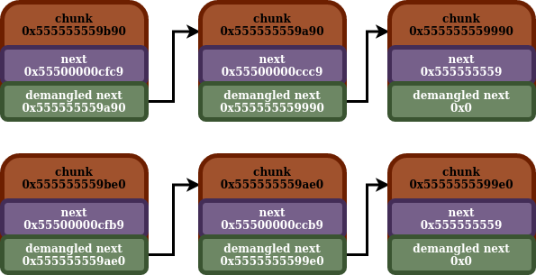

## Fastbin

- [back](readme.md)

So the fastbin is another heap binning mechanism designed to recycle previously freed chunks in future malloc allocations. Out of all of the heap binning mechanisms, it is probably most similar to the tcache.

Unlike the tcache, it is stored in an array in the `main_arena` (that will be covered in more detail later). It isn't tied to a particular thread. This array has `10` entries in it.

Similarly to the tcache, a fastbin consists of a singly linked list. There are multiple fast bins, each with a unique linked list. The chunks in these linked lists make up the chunks which will be recycled. Unlike the tcache, there really isn't a limit as to how many chunks can be present within a fastbin. Also unlike the tcache, it doesn't keep a count on the number of chunks currently present in the fastbin.

Similar to the tcache, there will be head ptrs stored to the fastbins. These head ptrs are stored in the fastbin array in the `main_arena`. Insertions and removals both happen at the head. Also like the tcache, each specific fastbin is supposed to store a specific size, with these being the bin to size mappings.

| Index | Size |
| ---- | ---- |
| 0 | 0x20 |
| 1 | 0x30 |
| 2 | 0x40 |
| 3 | 0x50 |
| 4 | 0x60 |
| 5 | 0x70 |
| 6 | 0x80 |
| 7 | Not Used |
| 8 | Not Used |
| 9 | Not Used |


Now the top three fastbins aren't used. This is (at least in part), because the default max fastbin size is `(64 * 8) / 4 = 0x80`. The first fastbin stores chunk sizes of `0x20`, so the top three fast bins aren't used:

```
#define DEFAULT_MXFAST 	(64 * SIZE_SZ / 4)
```

One thing you might notice is, the sizes the fast bin handles fall under the same sizes that the tcache handles. In general, malloc will try to both insert freed chunks, and malloc chunks from the tcache prior to using the fastbin. However, the tcache can indeed fill up, or run out of chunks, which is when the fastbin will be used. Also another interesting thing, if the tcache is enabled, and a chunk is removed from the fastbin, it will try to move as many chunks as it can from that fastbin over to the corresponding tcache bin for that size.

Also, ptr mangling is used with the next ptr stored in fastbin chunks, similar to tcache chunks, with this being the algorithm:

```
def mangle_ptr(next_ptr: int, ptr_loc: int) -> int:
	mangled_ptr = (next_ptr) ^ (ptr_loc >> 12)
	print(hex(mangled_ptr))
```

Here is a diagram detailing an example of some fastbins:



With this being the in memory representation of those fastbins:

```
gef➤  p main_arena
$1 = {
  mutex = 0x0,
  flags = 0x0,
  have_fastchunks = 0x1,
  fastbinsY = {0x555555559b90, 0x0, 0x0, 0x0, 0x0, 0x0, 0x555555559be0, 0x0, 0x0, 0x0},
  top = 0x555555559c90,
  last_remainder = 0x0,
  bins = {0x7ffff7e19ce0 <main_arena+96>, 0x7ffff7e19ce0 <main_arena+96>, 0x7ffff7e19cf0 <main_arena+112>, 0x7ffff7e19cf0 <main_arena+112>, 0x7ffff7e19d00 <main_arena+128>, 0x7ffff7e19d00 <main_arena+128>, 0x7ffff7e19d10 <main_arena+144>, 0x7ffff7e19d10 <main_arena+144>, 0x7ffff7e19d20 <main_arena+160>, 0x7ffff7e19d20 <main_arena+160>, 0x7ffff7e19d30 <main_arena+176>, 0x7ffff7e19d30 <main_arena+176>, 0x7ffff7e19d40 <main_arena+192>, 0x7ffff7e19d40 <main_arena+192>, 0x7ffff7e19d50 <main_arena+208>, 0x7ffff7e19d50 <main_arena+208>, 0x7ffff7e19d60 <main_arena+224>, 0x7ffff7e19d60 <main_arena+224>, 0x7ffff7e19d70 <main_arena+240>, 0x7ffff7e19d70 <main_arena+240>, 0x7ffff7e19d80 <main_arena+256>, 0x7ffff7e19d80 <main_arena+256>, 0x7ffff7e19d90 <main_arena+272>, 0x7ffff7e19d90 <main_arena+272>, 0x7ffff7e19da0 <main_arena+288>, 0x7ffff7e19da0 <main_arena+288>, 0x7ffff7e19db0 <main_arena+304>, 0x7ffff7e19db0 <main_arena+304>, 0x7ffff7e19dc0 <main_arena+320>, 0x7ffff7e19dc0 <main_arena+320>, 0x7ffff7e19dd0 <main_arena+336>, 0x7ffff7e19dd0 <main_arena+336>, 0x7ffff7e19de0 <main_arena+352>, 0x7ffff7e19de0 <main_arena+352>, 0x7ffff7e19df0 <main_arena+368>, 0x7ffff7e19df0 <main_arena+368>, 0x7ffff7e19e00 <main_arena+384>, 0x7ffff7e19e00 <main_arena+384>, 0x7ffff7e19e10 <main_arena+400>, 0x7ffff7e19e10 <main_arena+400>, 0x7ffff7e19e20 <main_arena+416>, 0x7ffff7e19e20 <main_arena+416>, 0x7ffff7e19e30 <main_arena+432>, 0x7ffff7e19e30 <main_arena+432>, 0x7ffff7e19e40 <main_arena+448>, 0x7ffff7e19e40 <main_arena+448>, 0x7ffff7e19e50 <main_arena+464>, 0x7ffff7e19e50 <main_arena+464>, 0x7ffff7e19e60 <main_arena+480>, 0x7ffff7e19e60 <main_arena+480>, 0x7ffff7e19e70 <main_arena+496>, 0x7ffff7e19e70 <main_arena+496>, 0x7ffff7e19e80 <main_arena+512>, 0x7ffff7e19e80 <main_arena+512>, 0x7ffff7e19e90 <main_arena+528>, 0x7ffff7e19e90 <main_arena+528>, 0x7ffff7e19ea0 <main_arena+544>, 0x7ffff7e19ea0 <main_arena+544>, 0x7ffff7e19eb0 <main_arena+560>, 0x7ffff7e19eb0 <main_arena+560>, 0x7ffff7e19ec0 <main_arena+576>, 0x7ffff7e19ec0 <main_arena+576>, 0x7ffff7e19ed0 <main_arena+592>, 0x7ffff7e19ed0 <main_arena+592>, 0x7ffff7e19ee0 <main_arena+608>, 0x7ffff7e19ee0 <main_arena+608>, 0x7ffff7e19ef0 <main_arena+624>, 0x7ffff7e19ef0 <main_arena+624>, 0x7ffff7e19f00 <main_arena+640>, 0x7ffff7e19f00 <main_arena+640>, 0x7ffff7e19f10 <main_arena+656>, 0x7ffff7e19f10 <main_arena+656>, 0x7ffff7e19f20 <main_arena+672>, 0x7ffff7e19f20 <main_arena+672>, 0x7ffff7e19f30 <main_arena+688>, 0x7ffff7e19f30 <main_arena+688>, 0x7ffff7e19f40 <main_arena+704>, 0x7ffff7e19f40 <main_arena+704>, 0x7ffff7e19f50 <main_arena+720>, 0x7ffff7e19f50 <main_arena+720>, 0x7ffff7e19f60 <main_arena+736>, 0x7ffff7e19f60 <main_arena+736>, 0x7ffff7e19f70 <main_arena+752>, 0x7ffff7e19f70 <main_arena+752>, 0x7ffff7e19f80 <main_arena+768>, 0x7ffff7e19f80 <main_arena+768>, 0x7ffff7e19f90 <main_arena+784>, 0x7ffff7e19f90 <main_arena+784>, 0x7ffff7e19fa0 <main_arena+800>, 0x7ffff7e19fa0 <main_arena+800>, 0x7ffff7e19fb0 <main_arena+816>, 0x7ffff7e19fb0 <main_arena+816>, 0x7ffff7e19fc0 <main_arena+832>, 0x7ffff7e19fc0 <main_arena+832>, 0x7ffff7e19fd0 <main_arena+848>, 0x7ffff7e19fd0 <main_arena+848>, 0x7ffff7e19fe0 <main_arena+864>, 0x7ffff7e19fe0 <main_arena+864>, 0x7ffff7e19ff0 <main_arena+880>, 0x7ffff7e19ff0 <main_arena+880>, 0x7ffff7e1a000 <main_arena+896>, 0x7ffff7e1a000 <main_arena+896>, 0x7ffff7e1a010 <main_arena+912>, 0x7ffff7e1a010 <main_arena+912>, 0x7ffff7e1a020 <main_arena+928>, 0x7ffff7e1a020 <main_arena+928>, 0x7ffff7e1a030 <main_arena+944>, 0x7ffff7e1a030 <main_arena+944>, 0x7ffff7e1a040 <main_arena+960>, 0x7ffff7e1a040 <main_arena+960>, 0x7ffff7e1a050 <main_arena+976>, 0x7ffff7e1a050 <main_arena+976>, 0x7ffff7e1a060 <main_arena+992>, 0x7ffff7e1a060 <main_arena+992>, 0x7ffff7e1a070 <main_arena+1008>, 0x7ffff7e1a070 <main_arena+1008>, 0x7ffff7e1a080 <main_arena+1024>, 0x7ffff7e1a080 <main_arena+1024>, 0x7ffff7e1a090 <main_arena+1040>, 0x7ffff7e1a090 <main_arena+1040>, 0x7ffff7e1a0a0 <main_arena+1056>, 0x7ffff7e1a0a0 <main_arena+1056>, 0x7ffff7e1a0b0 <main_arena+1072>, 0x7ffff7e1a0b0 <main_arena+1072>, 0x7ffff7e1a0c0 <main_arena+1088>, 0x7ffff7e1a0c0 <main_arena+1088>, 0x7ffff7e1a0d0 <main_arena+1104>, 0x7ffff7e1a0d0 <main_arena+1104>, 0x7ffff7e1a0e0 <main_arena+1120>, 0x7ffff7e1a0e0 <main_arena+1120>, 0x7ffff7e1a0f0 <main_arena+1136>, 0x7ffff7e1a0f0 <main_arena+1136>, 0x7ffff7e1a100 <main_arena+1152>, 0x7ffff7e1a100 <main_arena+1152>, 0x7ffff7e1a110 <main_arena+1168>, 0x7ffff7e1a110 <main_arena+1168>, 0x7ffff7e1a120 <main_arena+1184>, 0x7ffff7e1a120 <main_arena+1184>, 0x7ffff7e1a130 <main_arena+1200>, 0x7ffff7e1a130 <main_arena+1200>, 0x7ffff7e1a140 <main_arena+1216>, 0x7ffff7e1a140 <main_arena+1216>, 0x7ffff7e1a150 <main_arena+1232>, 0x7ffff7e1a150 <main_arena+1232>, 0x7ffff7e1a160 <main_arena+1248>, 0x7ffff7e1a160 <main_arena+1248>, 0x7ffff7e1a170 <main_arena+1264>, 0x7ffff7e1a170 <main_arena+1264>, 0x7ffff7e1a180 <main_arena+1280>, 0x7ffff7e1a180 <main_arena+1280>, 0x7ffff7e1a190 <main_arena+1296>, 0x7ffff7e1a190 <main_arena+1296>, 0x7ffff7e1a1a0 <main_arena+1312>, 0x7ffff7e1a1a0 <main_arena+1312>, 0x7ffff7e1a1b0 <main_arena+1328>, 0x7ffff7e1a1b0 <main_arena+1328>, 0x7ffff7e1a1c0 <main_arena+1344>, 0x7ffff7e1a1c0 <main_arena+1344>, 0x7ffff7e1a1d0 <main_arena+1360>, 0x7ffff7e1a1d0 <main_arena+1360>, 0x7ffff7e1a1e0 <main_arena+1376>, 0x7ffff7e1a1e0 <main_arena+1376>, 0x7ffff7e1a1f0 <main_arena+1392>, 0x7ffff7e1a1f0 <main_arena+1392>, 0x7ffff7e1a200 <main_arena+1408>, 0x7ffff7e1a200 <main_arena+1408>, 0x7ffff7e1a210 <main_arena+1424>, 0x7ffff7e1a210 <main_arena+1424>, 0x7ffff7e1a220 <main_arena+1440>, 0x7ffff7e1a220 <main_arena+1440>, 0x7ffff7e1a230 <main_arena+1456>, 0x7ffff7e1a230 <main_arena+1456>, 0x7ffff7e1a240 <main_arena+1472>, 0x7ffff7e1a240 <main_arena+1472>, 0x7ffff7e1a250 <main_arena+1488>, 0x7ffff7e1a250 <main_arena+1488>, 0x7ffff7e1a260 <main_arena+1504>, 0x7ffff7e1a260 <main_arena+1504>, 0x7ffff7e1a270 <main_arena+1520>, 0x7ffff7e1a270 <main_arena+1520>, 0x7ffff7e1a280 <main_arena+1536>, 0x7ffff7e1a280 <main_arena+1536>, 0x7ffff7e1a290 <main_arena+1552>, 0x7ffff7e1a290 <main_arena+1552>, 0x7ffff7e1a2a0 <main_arena+1568>, 0x7ffff7e1a2a0 <main_arena+1568>, 0x7ffff7e1a2b0 <main_arena+1584>, 0x7ffff7e1a2b0 <main_arena+1584>, 0x7ffff7e1a2c0 <main_arena+1600>, 0x7ffff7e1a2c0 <main_arena+1600>, 0x7ffff7e1a2d0 <main_arena+1616>, 0x7ffff7e1a2d0 <main_arena+1616>, 0x7ffff7e1a2e0 <main_arena+1632>, 0x7ffff7e1a2e0 <main_arena+1632>, 0x7ffff7e1a2f0 <main_arena+1648>, 0x7ffff7e1a2f0 <main_arena+1648>, 0x7ffff7e1a300 <main_arena+1664>, 0x7ffff7e1a300 <main_arena+1664>, 0x7ffff7e1a310 <main_arena+1680>, 0x7ffff7e1a310 <main_arena+1680>, 0x7ffff7e1a320 <main_arena+1696>, 0x7ffff7e1a320 <main_arena+1696>, 0x7ffff7e1a330 <main_arena+1712>, 0x7ffff7e1a330 <main_arena+1712>, 0x7ffff7e1a340 <main_arena+1728>, 0x7ffff7e1a340 <main_arena+1728>, 0x7ffff7e1a350 <main_arena+1744>, 0x7ffff7e1a350 <main_arena+1744>, 0x7ffff7e1a360 <main_arena+1760>, 0x7ffff7e1a360 <main_arena+1760>, 0x7ffff7e1a370 <main_arena+1776>, 0x7ffff7e1a370 <main_arena+1776>, 0x7ffff7e1a380 <main_arena+1792>, 0x7ffff7e1a380 <main_arena+1792>, 0x7ffff7e1a390 <main_arena+1808>, 0x7ffff7e1a390 <main_arena+1808>, 0x7ffff7e1a3a0 <main_arena+1824>, 0x7ffff7e1a3a0 <main_arena+1824>, 0x7ffff7e1a3b0 <main_arena+1840>, 0x7ffff7e1a3b0 <main_arena+1840>, 0x7ffff7e1a3c0 <main_arena+1856>, 0x7ffff7e1a3c0 <main_arena+1856>, 0x7ffff7e1a3d0 <main_arena+1872>, 0x7ffff7e1a3d0 <main_arena+1872>, 0x7ffff7e1a3e0 <main_arena+1888>, 0x7ffff7e1a3e0 <main_arena+1888>, 0x7ffff7e1a3f0 <main_arena+1904>, 0x7ffff7e1a3f0 <main_arena+1904>, 0x7ffff7e1a400 <main_arena+1920>, 0x7ffff7e1a400 <main_arena+1920>, 0x7ffff7e1a410 <main_arena+1936>, 0x7ffff7e1a410 <main_arena+1936>, 0x7ffff7e1a420 <main_arena+1952>, 0x7ffff7e1a420 <main_arena+1952>, 0x7ffff7e1a430 <main_arena+1968>, 0x7ffff7e1a430 <main_arena+1968>, 0x7ffff7e1a440 <main_arena+1984>, 0x7ffff7e1a440 <main_arena+1984>, 0x7ffff7e1a450 <main_arena+2000>, 0x7ffff7e1a450 <main_arena+2000>, 0x7ffff7e1a460 <main_arena+2016>, 0x7ffff7e1a460 <main_arena+2016>, 0x7ffff7e1a470 <main_arena+2032>, 0x7ffff7e1a470 <main_arena+2032>, 0x7ffff7e1a480 <main_arena+2048>, 0x7ffff7e1a480 <main_arena+2048>, 0x7ffff7e1a490 <main_arena+2064>, 0x7ffff7e1a490 <main_arena+2064>, 0x7ffff7e1a4a0 <main_arena+2080>, 0x7ffff7e1a4a0 <main_arena+2080>, 0x7ffff7e1a4b0 <main_arena+2096>, 0x7ffff7e1a4b0 <main_arena+2096>, 0x7ffff7e1a4c0 <main_arena+2112>, 0x7ffff7e1a4c0 <main_arena+2112>},
  binmap = {0x0, 0x0, 0x0, 0x0},
  next = 0x7ffff7e19c80 <main_arena>,
  next_free = 0x0,
  attached_threads = 0x1,
  system_mem = 0x21000,
  max_system_mem = 0x21000
}
gef➤  x/10g 0x7ffff7e19c80
0x7ffff7e19c80 <main_arena>:    0x0    0x1
0x7ffff7e19c90 <main_arena+16>:    0x555555559b90    0x0
0x7ffff7e19ca0 <main_arena+32>:    0x0    0x0
0x7ffff7e19cb0 <main_arena+48>:    0x0    0x0
0x7ffff7e19cc0 <main_arena+64>:    0x555555559be0    0x0
gef➤  x/10g 0x555555559b90
0x555555559b90:    0x0    0x21
0x555555559ba0:    0x55500000cfc9    0x0
0x555555559bb0:    0x0    0x31
0x555555559bc0:    0x0    0x0
0x555555559bd0:    0x0    0x0
gef➤  x/10g 0x555555559a90
0x555555559a90:    0x0    0x21
0x555555559aa0:    0x55500000ccc9    0x0
0x555555559ab0:    0x0    0x31
0x555555559ac0:    0x0    0x0
0x555555559ad0:    0x0    0x0
gef➤  x/10g 0x555555559990
0x555555559990:    0x0    0x21
0x5555555599a0:    0x555555559    0x0
0x5555555599b0:    0x0    0x31
0x5555555599c0:    0x0    0x0
0x5555555599d0:    0x0    0x0
gef➤  x/10g 0x555555559be0
0x555555559be0:    0x0    0x81
0x555555559bf0:    0x55500000cfb9    0x0
0x555555559c00:    0x0    0x0
0x555555559c10:    0x0    0x0
0x555555559c20:    0x0    0x0
gef➤  x/10g 0x555555559ae0
0x555555559ae0:    0x0    0x81
0x555555559af0:    0x55500000ccb9    0x0
0x555555559b00:    0x0    0x0
0x555555559b10:    0x0    0x0
0x555555559b20:    0x0    0x0
gef➤  x/10g 0x5555555599e0
0x5555555599e0:    0x0    0x81
0x5555555599f0:    0x555555559    0x0
0x555555559a00:    0x0    0x0
0x555555559a10:    0x0    0x0
0x555555559a20:    0x0    0x0
```

Ptr Demangling:

```
>>> mangle_ptr(0x55500000cfc9, 0x555555559ba0)
0x555555559a90
>>> mangle_ptr(0x55500000ccc9, 0x555555559aa0)
0x555555559990
>>> mangle_ptr(0x555555559, 0x5555555599a0)
0x0
>>> mangle_ptr(0x55500000cfb9, 0x555555559bf0)
0x555555559ae0
>>> mangle_ptr(0x55500000ccb9, 0x555555559af0)
0x5555555599e0
>>> mangle_ptr(0x555555559, 0x5555555599f0)
0x0
```
## Fastbin Insertion

So here we have an example of a chunk being inserted into a fastbin. Before the insertion, `0x555555559510` is the head chunk, which is followed by `0x5555555594c0`. The new chunk to be inserted is `0x555555559560`. Since insertions happen at the head, after this insertion, the fastbin will have three chunks, with `0x555555559560` being the new head chunk.

Before:
```
gef➤  p main_arena
$1 = {
  mutex = 0x0,
  flags = 0x0,
  have_fastchunks = 0x1,
  fastbinsY = {0x555555559510, 0x0, 0x0, 0x0, 0x0, 0x0, 0x0, 0x0, 0x0, 0x0},
  top = 0x5555555595b0,
  last_remainder = 0x0,
  bins = {0x7ffff7e19ce0 <main_arena+96>, 0x7ffff7e19ce0 <main_arena+96>, 0x7ffff7e19cf0 <main_arena+112>, 0x7ffff7e19cf0 <main_arena+112>, 0x7ffff7e19d00 <main_arena+128>, 0x7ffff7e19d00 <main_arena+128>, 0x7ffff7e19d10 <main_arena+144>, 0x7ffff7e19d10 <main_arena+144>, 0x7ffff7e19d20 <main_arena+160>, 0x7ffff7e19d20 <main_arena+160>, 0x7ffff7e19d30 <main_arena+176>, 0x7ffff7e19d30 <main_arena+176>, 0x7ffff7e19d40 <main_arena+192>, 0x7ffff7e19d40 <main_arena+192>, 0x7ffff7e19d50 <main_arena+208>, 0x7ffff7e19d50 <main_arena+208>, 0x7ffff7e19d60 <main_arena+224>, 0x7ffff7e19d60 <main_arena+224>, 0x7ffff7e19d70 <main_arena+240>, 0x7ffff7e19d70 <main_arena+240>, 0x7ffff7e19d80 <main_arena+256>, 0x7ffff7e19d80 <main_arena+256>, 0x7ffff7e19d90 <main_arena+272>, 0x7ffff7e19d90 <main_arena+272>, 0x7ffff7e19da0 <main_arena+288>, 0x7ffff7e19da0 <main_arena+288>, 0x7ffff7e19db0 <main_arena+304>, 0x7ffff7e19db0 <main_arena+304>, 0x7ffff7e19dc0 <main_arena+320>, 0x7ffff7e19dc0 <main_arena+320>, 0x7ffff7e19dd0 <main_arena+336>, 0x7ffff7e19dd0 <main_arena+336>, 0x7ffff7e19de0 <main_arena+352>, 0x7ffff7e19de0 <main_arena+352>, 0x7ffff7e19df0 <main_arena+368>, 0x7ffff7e19df0 <main_arena+368>, 0x7ffff7e19e00 <main_arena+384>, 0x7ffff7e19e00 <main_arena+384>, 0x7ffff7e19e10 <main_arena+400>, 0x7ffff7e19e10 <main_arena+400>, 0x7ffff7e19e20 <main_arena+416>, 0x7ffff7e19e20 <main_arena+416>, 0x7ffff7e19e30 <main_arena+432>, 0x7ffff7e19e30 <main_arena+432>, 0x7ffff7e19e40 <main_arena+448>, 0x7ffff7e19e40 <main_arena+448>, 0x7ffff7e19e50 <main_arena+464>, 0x7ffff7e19e50 <main_arena+464>, 0x7ffff7e19e60 <main_arena+480>, 0x7ffff7e19e60 <main_arena+480>, 0x7ffff7e19e70 <main_arena+496>, 0x7ffff7e19e70 <main_arena+496>, 0x7ffff7e19e80 <main_arena+512>, 0x7ffff7e19e80 <main_arena+512>, 0x7ffff7e19e90 <main_arena+528>, 0x7ffff7e19e90 <main_arena+528>, 0x7ffff7e19ea0 <main_arena+544>, 0x7ffff7e19ea0 <main_arena+544>, 0x7ffff7e19eb0 <main_arena+560>, 0x7ffff7e19eb0 <main_arena+560>, 0x7ffff7e19ec0 <main_arena+576>, 0x7ffff7e19ec0 <main_arena+576>, 0x7ffff7e19ed0 <main_arena+592>, 0x7ffff7e19ed0 <main_arena+592>, 0x7ffff7e19ee0 <main_arena+608>, 0x7ffff7e19ee0 <main_arena+608>, 0x7ffff7e19ef0 <main_arena+624>, 0x7ffff7e19ef0 <main_arena+624>, 0x7ffff7e19f00 <main_arena+640>, 0x7ffff7e19f00 <main_arena+640>, 0x7ffff7e19f10 <main_arena+656>, 0x7ffff7e19f10 <main_arena+656>, 0x7ffff7e19f20 <main_arena+672>, 0x7ffff7e19f20 <main_arena+672>, 0x7ffff7e19f30 <main_arena+688>, 0x7ffff7e19f30 <main_arena+688>, 0x7ffff7e19f40 <main_arena+704>, 0x7ffff7e19f40 <main_arena+704>, 0x7ffff7e19f50 <main_arena+720>, 0x7ffff7e19f50 <main_arena+720>, 0x7ffff7e19f60 <main_arena+736>, 0x7ffff7e19f60 <main_arena+736>, 0x7ffff7e19f70 <main_arena+752>, 0x7ffff7e19f70 <main_arena+752>, 0x7ffff7e19f80 <main_arena+768>, 0x7ffff7e19f80 <main_arena+768>, 0x7ffff7e19f90 <main_arena+784>, 0x7ffff7e19f90 <main_arena+784>, 0x7ffff7e19fa0 <main_arena+800>, 0x7ffff7e19fa0 <main_arena+800>, 0x7ffff7e19fb0 <main_arena+816>, 0x7ffff7e19fb0 <main_arena+816>, 0x7ffff7e19fc0 <main_arena+832>, 0x7ffff7e19fc0 <main_arena+832>, 0x7ffff7e19fd0 <main_arena+848>, 0x7ffff7e19fd0 <main_arena+848>, 0x7ffff7e19fe0 <main_arena+864>, 0x7ffff7e19fe0 <main_arena+864>, 0x7ffff7e19ff0 <main_arena+880>, 0x7ffff7e19ff0 <main_arena+880>, 0x7ffff7e1a000 <main_arena+896>, 0x7ffff7e1a000 <main_arena+896>, 0x7ffff7e1a010 <main_arena+912>, 0x7ffff7e1a010 <main_arena+912>, 0x7ffff7e1a020 <main_arena+928>, 0x7ffff7e1a020 <main_arena+928>, 0x7ffff7e1a030 <main_arena+944>, 0x7ffff7e1a030 <main_arena+944>, 0x7ffff7e1a040 <main_arena+960>, 0x7ffff7e1a040 <main_arena+960>, 0x7ffff7e1a050 <main_arena+976>, 0x7ffff7e1a050 <main_arena+976>, 0x7ffff7e1a060 <main_arena+992>, 0x7ffff7e1a060 <main_arena+992>, 0x7ffff7e1a070 <main_arena+1008>, 0x7ffff7e1a070 <main_arena+1008>, 0x7ffff7e1a080 <main_arena+1024>, 0x7ffff7e1a080 <main_arena+1024>, 0x7ffff7e1a090 <main_arena+1040>, 0x7ffff7e1a090 <main_arena+1040>, 0x7ffff7e1a0a0 <main_arena+1056>, 0x7ffff7e1a0a0 <main_arena+1056>, 0x7ffff7e1a0b0 <main_arena+1072>, 0x7ffff7e1a0b0 <main_arena+1072>, 0x7ffff7e1a0c0 <main_arena+1088>, 0x7ffff7e1a0c0 <main_arena+1088>, 0x7ffff7e1a0d0 <main_arena+1104>, 0x7ffff7e1a0d0 <main_arena+1104>, 0x7ffff7e1a0e0 <main_arena+1120>, 0x7ffff7e1a0e0 <main_arena+1120>, 0x7ffff7e1a0f0 <main_arena+1136>, 0x7ffff7e1a0f0 <main_arena+1136>, 0x7ffff7e1a100 <main_arena+1152>, 0x7ffff7e1a100 <main_arena+1152>, 0x7ffff7e1a110 <main_arena+1168>, 0x7ffff7e1a110 <main_arena+1168>, 0x7ffff7e1a120 <main_arena+1184>, 0x7ffff7e1a120 <main_arena+1184>, 0x7ffff7e1a130 <main_arena+1200>, 0x7ffff7e1a130 <main_arena+1200>, 0x7ffff7e1a140 <main_arena+1216>, 0x7ffff7e1a140 <main_arena+1216>, 0x7ffff7e1a150 <main_arena+1232>, 0x7ffff7e1a150 <main_arena+1232>, 0x7ffff7e1a160 <main_arena+1248>, 0x7ffff7e1a160 <main_arena+1248>, 0x7ffff7e1a170 <main_arena+1264>, 0x7ffff7e1a170 <main_arena+1264>, 0x7ffff7e1a180 <main_arena+1280>, 0x7ffff7e1a180 <main_arena+1280>, 0x7ffff7e1a190 <main_arena+1296>, 0x7ffff7e1a190 <main_arena+1296>, 0x7ffff7e1a1a0 <main_arena+1312>, 0x7ffff7e1a1a0 <main_arena+1312>, 0x7ffff7e1a1b0 <main_arena+1328>, 0x7ffff7e1a1b0 <main_arena+1328>, 0x7ffff7e1a1c0 <main_arena+1344>, 0x7ffff7e1a1c0 <main_arena+1344>, 0x7ffff7e1a1d0 <main_arena+1360>, 0x7ffff7e1a1d0 <main_arena+1360>, 0x7ffff7e1a1e0 <main_arena+1376>, 0x7ffff7e1a1e0 <main_arena+1376>, 0x7ffff7e1a1f0 <main_arena+1392>, 0x7ffff7e1a1f0 <main_arena+1392>, 0x7ffff7e1a200 <main_arena+1408>, 0x7ffff7e1a200 <main_arena+1408>, 0x7ffff7e1a210 <main_arena+1424>, 0x7ffff7e1a210 <main_arena+1424>, 0x7ffff7e1a220 <main_arena+1440>, 0x7ffff7e1a220 <main_arena+1440>, 0x7ffff7e1a230 <main_arena+1456>, 0x7ffff7e1a230 <main_arena+1456>, 0x7ffff7e1a240 <main_arena+1472>, 0x7ffff7e1a240 <main_arena+1472>, 0x7ffff7e1a250 <main_arena+1488>, 0x7ffff7e1a250 <main_arena+1488>, 0x7ffff7e1a260 <main_arena+1504>, 0x7ffff7e1a260 <main_arena+1504>, 0x7ffff7e1a270 <main_arena+1520>, 0x7ffff7e1a270 <main_arena+1520>, 0x7ffff7e1a280 <main_arena+1536>, 0x7ffff7e1a280 <main_arena+1536>, 0x7ffff7e1a290 <main_arena+1552>, 0x7ffff7e1a290 <main_arena+1552>, 0x7ffff7e1a2a0 <main_arena+1568>, 0x7ffff7e1a2a0 <main_arena+1568>, 0x7ffff7e1a2b0 <main_arena+1584>, 0x7ffff7e1a2b0 <main_arena+1584>, 0x7ffff7e1a2c0 <main_arena+1600>, 0x7ffff7e1a2c0 <main_arena+1600>, 0x7ffff7e1a2d0 <main_arena+1616>, 0x7ffff7e1a2d0 <main_arena+1616>, 0x7ffff7e1a2e0 <main_arena+1632>, 0x7ffff7e1a2e0 <main_arena+1632>, 0x7ffff7e1a2f0 <main_arena+1648>, 0x7ffff7e1a2f0 <main_arena+1648>, 0x7ffff7e1a300 <main_arena+1664>, 0x7ffff7e1a300 <main_arena+1664>, 0x7ffff7e1a310 <main_arena+1680>, 0x7ffff7e1a310 <main_arena+1680>, 0x7ffff7e1a320 <main_arena+1696>, 0x7ffff7e1a320 <main_arena+1696>, 0x7ffff7e1a330 <main_arena+1712>, 0x7ffff7e1a330 <main_arena+1712>, 0x7ffff7e1a340 <main_arena+1728>, 0x7ffff7e1a340 <main_arena+1728>, 0x7ffff7e1a350 <main_arena+1744>, 0x7ffff7e1a350 <main_arena+1744>, 0x7ffff7e1a360 <main_arena+1760>, 0x7ffff7e1a360 <main_arena+1760>, 0x7ffff7e1a370 <main_arena+1776>, 0x7ffff7e1a370 <main_arena+1776>, 0x7ffff7e1a380 <main_arena+1792>, 0x7ffff7e1a380 <main_arena+1792>, 0x7ffff7e1a390 <main_arena+1808>, 0x7ffff7e1a390 <main_arena+1808>, 0x7ffff7e1a3a0 <main_arena+1824>, 0x7ffff7e1a3a0 <main_arena+1824>, 0x7ffff7e1a3b0 <main_arena+1840>, 0x7ffff7e1a3b0 <main_arena+1840>, 0x7ffff7e1a3c0 <main_arena+1856>, 0x7ffff7e1a3c0 <main_arena+1856>, 0x7ffff7e1a3d0 <main_arena+1872>, 0x7ffff7e1a3d0 <main_arena+1872>, 0x7ffff7e1a3e0 <main_arena+1888>, 0x7ffff7e1a3e0 <main_arena+1888>, 0x7ffff7e1a3f0 <main_arena+1904>, 0x7ffff7e1a3f0 <main_arena+1904>, 0x7ffff7e1a400 <main_arena+1920>, 0x7ffff7e1a400 <main_arena+1920>, 0x7ffff7e1a410 <main_arena+1936>, 0x7ffff7e1a410 <main_arena+1936>, 0x7ffff7e1a420 <main_arena+1952>, 0x7ffff7e1a420 <main_arena+1952>, 0x7ffff7e1a430 <main_arena+1968>, 0x7ffff7e1a430 <main_arena+1968>, 0x7ffff7e1a440 <main_arena+1984>, 0x7ffff7e1a440 <main_arena+1984>, 0x7ffff7e1a450 <main_arena+2000>, 0x7ffff7e1a450 <main_arena+2000>, 0x7ffff7e1a460 <main_arena+2016>, 0x7ffff7e1a460 <main_arena+2016>, 0x7ffff7e1a470 <main_arena+2032>, 0x7ffff7e1a470 <main_arena+2032>, 0x7ffff7e1a480 <main_arena+2048>, 0x7ffff7e1a480 <main_arena+2048>, 0x7ffff7e1a490 <main_arena+2064>, 0x7ffff7e1a490 <main_arena+2064>, 0x7ffff7e1a4a0 <main_arena+2080>, 0x7ffff7e1a4a0 <main_arena+2080>, 0x7ffff7e1a4b0 <main_arena+2096>, 0x7ffff7e1a4b0 <main_arena+2096>, 0x7ffff7e1a4c0 <main_arena+2112>, 0x7ffff7e1a4c0 <main_arena+2112>},
  binmap = {0x0, 0x0, 0x0, 0x0},
  next = 0x7ffff7e19c80 <main_arena>,
  next_free = 0x0,
  attached_threads = 0x1,
  system_mem = 0x21000,
  max_system_mem = 0x21000
}
gef➤  x/10g 0x7ffff7e19c80
0x7ffff7e19c80 <main_arena>:    0x0    0x1
0x7ffff7e19c90 <main_arena+16>:    0x555555559510    0x0
0x7ffff7e19ca0 <main_arena+32>:    0x0    0x0
0x7ffff7e19cb0 <main_arena+48>:    0x0    0x0
0x7ffff7e19cc0 <main_arena+64>:    0x0    0x0
gef➤  x/10g 0x555555559510
0x555555559510:    0x0    0x21
0x555555559520:    0x55500000c199    0x0
0x555555559530:    0x0    0x31
0x555555559540:    0x0    0x0
0x555555559550:    0x0    0x0
gef➤  x/10g 0x5555555594c0
0x5555555594c0:    0x0    0x21
0x5555555594d0:    0x555555559    0x0
0x5555555594e0:    0x0    0x31
0x5555555594f0:    0x0    0x0
0x555555559500:    0x0    0x0
```

After:
```
gef➤  p main_arena
$2 = {
  mutex = 0x0,
  flags = 0x0,
  have_fastchunks = 0x1,
  fastbinsY = {0x555555559560, 0x0, 0x0, 0x0, 0x0, 0x0, 0x0, 0x0, 0x0, 0x0},
  top = 0x5555555595b0,
  last_remainder = 0x0,
  bins = {0x7ffff7e19ce0 <main_arena+96>, 0x7ffff7e19ce0 <main_arena+96>, 0x7ffff7e19cf0 <main_arena+112>, 0x7ffff7e19cf0 <main_arena+112>, 0x7ffff7e19d00 <main_arena+128>, 0x7ffff7e19d00 <main_arena+128>, 0x7ffff7e19d10 <main_arena+144>, 0x7ffff7e19d10 <main_arena+144>, 0x7ffff7e19d20 <main_arena+160>, 0x7ffff7e19d20 <main_arena+160>, 0x7ffff7e19d30 <main_arena+176>, 0x7ffff7e19d30 <main_arena+176>, 0x7ffff7e19d40 <main_arena+192>, 0x7ffff7e19d40 <main_arena+192>, 0x7ffff7e19d50 <main_arena+208>, 0x7ffff7e19d50 <main_arena+208>, 0x7ffff7e19d60 <main_arena+224>, 0x7ffff7e19d60 <main_arena+224>, 0x7ffff7e19d70 <main_arena+240>, 0x7ffff7e19d70 <main_arena+240>, 0x7ffff7e19d80 <main_arena+256>, 0x7ffff7e19d80 <main_arena+256>, 0x7ffff7e19d90 <main_arena+272>, 0x7ffff7e19d90 <main_arena+272>, 0x7ffff7e19da0 <main_arena+288>, 0x7ffff7e19da0 <main_arena+288>, 0x7ffff7e19db0 <main_arena+304>, 0x7ffff7e19db0 <main_arena+304>, 0x7ffff7e19dc0 <main_arena+320>, 0x7ffff7e19dc0 <main_arena+320>, 0x7ffff7e19dd0 <main_arena+336>, 0x7ffff7e19dd0 <main_arena+336>, 0x7ffff7e19de0 <main_arena+352>, 0x7ffff7e19de0 <main_arena+352>, 0x7ffff7e19df0 <main_arena+368>, 0x7ffff7e19df0 <main_arena+368>, 0x7ffff7e19e00 <main_arena+384>, 0x7ffff7e19e00 <main_arena+384>, 0x7ffff7e19e10 <main_arena+400>, 0x7ffff7e19e10 <main_arena+400>, 0x7ffff7e19e20 <main_arena+416>, 0x7ffff7e19e20 <main_arena+416>, 0x7ffff7e19e30 <main_arena+432>, 0x7ffff7e19e30 <main_arena+432>, 0x7ffff7e19e40 <main_arena+448>, 0x7ffff7e19e40 <main_arena+448>, 0x7ffff7e19e50 <main_arena+464>, 0x7ffff7e19e50 <main_arena+464>, 0x7ffff7e19e60 <main_arena+480>, 0x7ffff7e19e60 <main_arena+480>, 0x7ffff7e19e70 <main_arena+496>, 0x7ffff7e19e70 <main_arena+496>, 0x7ffff7e19e80 <main_arena+512>, 0x7ffff7e19e80 <main_arena+512>, 0x7ffff7e19e90 <main_arena+528>, 0x7ffff7e19e90 <main_arena+528>, 0x7ffff7e19ea0 <main_arena+544>, 0x7ffff7e19ea0 <main_arena+544>, 0x7ffff7e19eb0 <main_arena+560>, 0x7ffff7e19eb0 <main_arena+560>, 0x7ffff7e19ec0 <main_arena+576>, 0x7ffff7e19ec0 <main_arena+576>, 0x7ffff7e19ed0 <main_arena+592>, 0x7ffff7e19ed0 <main_arena+592>, 0x7ffff7e19ee0 <main_arena+608>, 0x7ffff7e19ee0 <main_arena+608>, 0x7ffff7e19ef0 <main_arena+624>, 0x7ffff7e19ef0 <main_arena+624>, 0x7ffff7e19f00 <main_arena+640>, 0x7ffff7e19f00 <main_arena+640>, 0x7ffff7e19f10 <main_arena+656>, 0x7ffff7e19f10 <main_arena+656>, 0x7ffff7e19f20 <main_arena+672>, 0x7ffff7e19f20 <main_arena+672>, 0x7ffff7e19f30 <main_arena+688>, 0x7ffff7e19f30 <main_arena+688>, 0x7ffff7e19f40 <main_arena+704>, 0x7ffff7e19f40 <main_arena+704>, 0x7ffff7e19f50 <main_arena+720>, 0x7ffff7e19f50 <main_arena+720>, 0x7ffff7e19f60 <main_arena+736>, 0x7ffff7e19f60 <main_arena+736>, 0x7ffff7e19f70 <main_arena+752>, 0x7ffff7e19f70 <main_arena+752>, 0x7ffff7e19f80 <main_arena+768>, 0x7ffff7e19f80 <main_arena+768>, 0x7ffff7e19f90 <main_arena+784>, 0x7ffff7e19f90 <main_arena+784>, 0x7ffff7e19fa0 <main_arena+800>, 0x7ffff7e19fa0 <main_arena+800>, 0x7ffff7e19fb0 <main_arena+816>, 0x7ffff7e19fb0 <main_arena+816>, 0x7ffff7e19fc0 <main_arena+832>, 0x7ffff7e19fc0 <main_arena+832>, 0x7ffff7e19fd0 <main_arena+848>, 0x7ffff7e19fd0 <main_arena+848>, 0x7ffff7e19fe0 <main_arena+864>, 0x7ffff7e19fe0 <main_arena+864>, 0x7ffff7e19ff0 <main_arena+880>, 0x7ffff7e19ff0 <main_arena+880>, 0x7ffff7e1a000 <main_arena+896>, 0x7ffff7e1a000 <main_arena+896>, 0x7ffff7e1a010 <main_arena+912>, 0x7ffff7e1a010 <main_arena+912>, 0x7ffff7e1a020 <main_arena+928>, 0x7ffff7e1a020 <main_arena+928>, 0x7ffff7e1a030 <main_arena+944>, 0x7ffff7e1a030 <main_arena+944>, 0x7ffff7e1a040 <main_arena+960>, 0x7ffff7e1a040 <main_arena+960>, 0x7ffff7e1a050 <main_arena+976>, 0x7ffff7e1a050 <main_arena+976>, 0x7ffff7e1a060 <main_arena+992>, 0x7ffff7e1a060 <main_arena+992>, 0x7ffff7e1a070 <main_arena+1008>, 0x7ffff7e1a070 <main_arena+1008>, 0x7ffff7e1a080 <main_arena+1024>, 0x7ffff7e1a080 <main_arena+1024>, 0x7ffff7e1a090 <main_arena+1040>, 0x7ffff7e1a090 <main_arena+1040>, 0x7ffff7e1a0a0 <main_arena+1056>, 0x7ffff7e1a0a0 <main_arena+1056>, 0x7ffff7e1a0b0 <main_arena+1072>, 0x7ffff7e1a0b0 <main_arena+1072>, 0x7ffff7e1a0c0 <main_arena+1088>, 0x7ffff7e1a0c0 <main_arena+1088>, 0x7ffff7e1a0d0 <main_arena+1104>, 0x7ffff7e1a0d0 <main_arena+1104>, 0x7ffff7e1a0e0 <main_arena+1120>, 0x7ffff7e1a0e0 <main_arena+1120>, 0x7ffff7e1a0f0 <main_arena+1136>, 0x7ffff7e1a0f0 <main_arena+1136>, 0x7ffff7e1a100 <main_arena+1152>, 0x7ffff7e1a100 <main_arena+1152>, 0x7ffff7e1a110 <main_arena+1168>, 0x7ffff7e1a110 <main_arena+1168>, 0x7ffff7e1a120 <main_arena+1184>, 0x7ffff7e1a120 <main_arena+1184>, 0x7ffff7e1a130 <main_arena+1200>, 0x7ffff7e1a130 <main_arena+1200>, 0x7ffff7e1a140 <main_arena+1216>, 0x7ffff7e1a140 <main_arena+1216>, 0x7ffff7e1a150 <main_arena+1232>, 0x7ffff7e1a150 <main_arena+1232>, 0x7ffff7e1a160 <main_arena+1248>, 0x7ffff7e1a160 <main_arena+1248>, 0x7ffff7e1a170 <main_arena+1264>, 0x7ffff7e1a170 <main_arena+1264>, 0x7ffff7e1a180 <main_arena+1280>, 0x7ffff7e1a180 <main_arena+1280>, 0x7ffff7e1a190 <main_arena+1296>, 0x7ffff7e1a190 <main_arena+1296>, 0x7ffff7e1a1a0 <main_arena+1312>, 0x7ffff7e1a1a0 <main_arena+1312>, 0x7ffff7e1a1b0 <main_arena+1328>, 0x7ffff7e1a1b0 <main_arena+1328>, 0x7ffff7e1a1c0 <main_arena+1344>, 0x7ffff7e1a1c0 <main_arena+1344>, 0x7ffff7e1a1d0 <main_arena+1360>, 0x7ffff7e1a1d0 <main_arena+1360>, 0x7ffff7e1a1e0 <main_arena+1376>, 0x7ffff7e1a1e0 <main_arena+1376>, 0x7ffff7e1a1f0 <main_arena+1392>, 0x7ffff7e1a1f0 <main_arena+1392>, 0x7ffff7e1a200 <main_arena+1408>, 0x7ffff7e1a200 <main_arena+1408>, 0x7ffff7e1a210 <main_arena+1424>, 0x7ffff7e1a210 <main_arena+1424>, 0x7ffff7e1a220 <main_arena+1440>, 0x7ffff7e1a220 <main_arena+1440>, 0x7ffff7e1a230 <main_arena+1456>, 0x7ffff7e1a230 <main_arena+1456>, 0x7ffff7e1a240 <main_arena+1472>, 0x7ffff7e1a240 <main_arena+1472>, 0x7ffff7e1a250 <main_arena+1488>, 0x7ffff7e1a250 <main_arena+1488>, 0x7ffff7e1a260 <main_arena+1504>, 0x7ffff7e1a260 <main_arena+1504>, 0x7ffff7e1a270 <main_arena+1520>, 0x7ffff7e1a270 <main_arena+1520>, 0x7ffff7e1a280 <main_arena+1536>, 0x7ffff7e1a280 <main_arena+1536>, 0x7ffff7e1a290 <main_arena+1552>, 0x7ffff7e1a290 <main_arena+1552>, 0x7ffff7e1a2a0 <main_arena+1568>, 0x7ffff7e1a2a0 <main_arena+1568>, 0x7ffff7e1a2b0 <main_arena+1584>, 0x7ffff7e1a2b0 <main_arena+1584>, 0x7ffff7e1a2c0 <main_arena+1600>, 0x7ffff7e1a2c0 <main_arena+1600>, 0x7ffff7e1a2d0 <main_arena+1616>, 0x7ffff7e1a2d0 <main_arena+1616>, 0x7ffff7e1a2e0 <main_arena+1632>, 0x7ffff7e1a2e0 <main_arena+1632>, 0x7ffff7e1a2f0 <main_arena+1648>, 0x7ffff7e1a2f0 <main_arena+1648>, 0x7ffff7e1a300 <main_arena+1664>, 0x7ffff7e1a300 <main_arena+1664>, 0x7ffff7e1a310 <main_arena+1680>, 0x7ffff7e1a310 <main_arena+1680>, 0x7ffff7e1a320 <main_arena+1696>, 0x7ffff7e1a320 <main_arena+1696>, 0x7ffff7e1a330 <main_arena+1712>, 0x7ffff7e1a330 <main_arena+1712>, 0x7ffff7e1a340 <main_arena+1728>, 0x7ffff7e1a340 <main_arena+1728>, 0x7ffff7e1a350 <main_arena+1744>, 0x7ffff7e1a350 <main_arena+1744>, 0x7ffff7e1a360 <main_arena+1760>, 0x7ffff7e1a360 <main_arena+1760>, 0x7ffff7e1a370 <main_arena+1776>, 0x7ffff7e1a370 <main_arena+1776>, 0x7ffff7e1a380 <main_arena+1792>, 0x7ffff7e1a380 <main_arena+1792>, 0x7ffff7e1a390 <main_arena+1808>, 0x7ffff7e1a390 <main_arena+1808>, 0x7ffff7e1a3a0 <main_arena+1824>, 0x7ffff7e1a3a0 <main_arena+1824>, 0x7ffff7e1a3b0 <main_arena+1840>, 0x7ffff7e1a3b0 <main_arena+1840>, 0x7ffff7e1a3c0 <main_arena+1856>, 0x7ffff7e1a3c0 <main_arena+1856>, 0x7ffff7e1a3d0 <main_arena+1872>, 0x7ffff7e1a3d0 <main_arena+1872>, 0x7ffff7e1a3e0 <main_arena+1888>, 0x7ffff7e1a3e0 <main_arena+1888>, 0x7ffff7e1a3f0 <main_arena+1904>, 0x7ffff7e1a3f0 <main_arena+1904>, 0x7ffff7e1a400 <main_arena+1920>, 0x7ffff7e1a400 <main_arena+1920>, 0x7ffff7e1a410 <main_arena+1936>, 0x7ffff7e1a410 <main_arena+1936>, 0x7ffff7e1a420 <main_arena+1952>, 0x7ffff7e1a420 <main_arena+1952>, 0x7ffff7e1a430 <main_arena+1968>, 0x7ffff7e1a430 <main_arena+1968>, 0x7ffff7e1a440 <main_arena+1984>, 0x7ffff7e1a440 <main_arena+1984>, 0x7ffff7e1a450 <main_arena+2000>, 0x7ffff7e1a450 <main_arena+2000>, 0x7ffff7e1a460 <main_arena+2016>, 0x7ffff7e1a460 <main_arena+2016>, 0x7ffff7e1a470 <main_arena+2032>, 0x7ffff7e1a470 <main_arena+2032>, 0x7ffff7e1a480 <main_arena+2048>, 0x7ffff7e1a480 <main_arena+2048>, 0x7ffff7e1a490 <main_arena+2064>, 0x7ffff7e1a490 <main_arena+2064>, 0x7ffff7e1a4a0 <main_arena+2080>, 0x7ffff7e1a4a0 <main_arena+2080>, 0x7ffff7e1a4b0 <main_arena+2096>, 0x7ffff7e1a4b0 <main_arena+2096>, 0x7ffff7e1a4c0 <main_arena+2112>, 0x7ffff7e1a4c0 <main_arena+2112>},
  binmap = {0x0, 0x0, 0x0, 0x0},
  next = 0x7ffff7e19c80 <main_arena>,
  next_free = 0x0,
  attached_threads = 0x1,
  system_mem = 0x21000,
  max_system_mem = 0x21000
}
gef➤  x/10g 0x7ffff7e19c80
0x7ffff7e19c80 <main_arena>:    0x0    0x1
0x7ffff7e19c90 <main_arena+16>:    0x555555559560    0x0
0x7ffff7e19ca0 <main_arena+32>:    0x0    0x0
0x7ffff7e19cb0 <main_arena+48>:    0x0    0x0
0x7ffff7e19cc0 <main_arena+64>:    0x0    0x0
gef➤  x/10g 0x555555559560
0x555555559560:    0x0    0x21
0x555555559570:    0x55500000c049    0x0
0x555555559580:    0x0    0x31
0x555555559590:    0x0    0x0
0x5555555595a0:    0x0    0x0
gef➤  x/10g 0x555555559510
0x555555559510:    0x0    0x21
0x555555559520:    0x55500000c199    0x0
0x555555559530:    0x0    0x31
0x555555559540:    0x0    0x0
0x555555559550:    0x0    0x0
gef➤  x/10g 0x5555555594c0
0x5555555594c0:    0x0    0x21
0x5555555594d0:    0x555555559    0x0
0x5555555594e0:    0x0    0x31
0x5555555594f0:    0x0    0x0
0x555555559500:    0x0    0x0
```

Ptr Demangling:
```
>>> mangle_ptr(0x55500000c199, 0x555555559520)
0x5555555594c0
>>> mangle_ptr(0x555555559, 0x5555555594d0)
0x0
>>> mangle_ptr(0x55500000c049, 0x555555559570)
0x555555559510
```

## Fastbin Removal

So here, we have an instance where we are removing a chunk from a fastbin. The fastbin has three chunks in it, with `0x555555559560` being the head, followed by `0x555555559510`, and then finally `0x5555555594c0`. We also see that the tcache is completely empty. What will happen here is, the head chunk (`0x555555559560`) will be removed and allocated. However since the tcache has space to do this, malloc will actually move the two remaining chunks from the fastbin over to the corresponding tcache bin, thus emptying out the fastbin. Since insertions and removals both happen at the head for the tcache and fastbin, the ordering of the last two chunks will be flipped (`0x5555555594c0` will be the head, followed by `0x555555559510`).

Now another interesting thing here to note is, the fastbin uses the ptrs `0x5555555594c0/0x555555559510`, and the tcache uses the ptrs `0x5555555594d0/0x555555559520`. The tcache ptr are to `0x10` bytes past the fastbin ptrs. These ptrs are to the same chunks, but rather to different spots in the chunk. The fastbin ptrs are to the start of the heap header (which stores the heap metadata), and the tcache chunks are to the user data portion of the chunk.

Before:
```
gef➤  x/80g tcache
0x555555559010:    0x0    0x0
0x555555559020:    0x0    0x0
0x555555559030:    0x0    0x0
0x555555559040:    0x0    0x0
0x555555559050:    0x0    0x0
0x555555559060:    0x0    0x0
0x555555559070:    0x0    0x0
0x555555559080:    0x0    0x0
0x555555559090:    0x0    0x0
0x5555555590a0:    0x0    0x0
0x5555555590b0:    0x0    0x0
0x5555555590c0:    0x0    0x0
0x5555555590d0:    0x0    0x0
0x5555555590e0:    0x0    0x0
0x5555555590f0:    0x0    0x0
0x555555559100:    0x0    0x0
0x555555559110:    0x0    0x0
0x555555559120:    0x0    0x0
0x555555559130:    0x0    0x0
0x555555559140:    0x0    0x0
0x555555559150:    0x0    0x0
0x555555559160:    0x0    0x0
0x555555559170:    0x0    0x0
0x555555559180:    0x0    0x0
0x555555559190:    0x0    0x0
0x5555555591a0:    0x0    0x0
0x5555555591b0:    0x0    0x0
0x5555555591c0:    0x0    0x0
0x5555555591d0:    0x0    0x0
0x5555555591e0:    0x0    0x0
0x5555555591f0:    0x0    0x0
0x555555559200:    0x0    0x0
0x555555559210:    0x0    0x0
0x555555559220:    0x0    0x0
0x555555559230:    0x0    0x0
0x555555559240:    0x0    0x0
0x555555559250:    0x0    0x0
0x555555559260:    0x0    0x0
0x555555559270:    0x0    0x0
0x555555559280:    0x0    0x0
gef➤  p main_arena
$1 = {
  mutex = 0x0,
  flags = 0x0,
  have_fastchunks = 0x1,
  fastbinsY = {0x555555559560, 0x0, 0x0, 0x0, 0x0, 0x0, 0x0, 0x0, 0x0, 0x0},
  top = 0x5555555595b0,
  last_remainder = 0x0,
  bins = {0x7ffff7e19ce0 <main_arena+96>, 0x7ffff7e19ce0 <main_arena+96>, 0x7ffff7e19cf0 <main_arena+112>, 0x7ffff7e19cf0 <main_arena+112>, 0x7ffff7e19d00 <main_arena+128>, 0x7ffff7e19d00 <main_arena+128>, 0x7ffff7e19d10 <main_arena+144>, 0x7ffff7e19d10 <main_arena+144>, 0x7ffff7e19d20 <main_arena+160>, 0x7ffff7e19d20 <main_arena+160>, 0x7ffff7e19d30 <main_arena+176>, 0x7ffff7e19d30 <main_arena+176>, 0x7ffff7e19d40 <main_arena+192>, 0x7ffff7e19d40 <main_arena+192>, 0x7ffff7e19d50 <main_arena+208>, 0x7ffff7e19d50 <main_arena+208>, 0x7ffff7e19d60 <main_arena+224>, 0x7ffff7e19d60 <main_arena+224>, 0x7ffff7e19d70 <main_arena+240>, 0x7ffff7e19d70 <main_arena+240>, 0x7ffff7e19d80 <main_arena+256>, 0x7ffff7e19d80 <main_arena+256>, 0x7ffff7e19d90 <main_arena+272>, 0x7ffff7e19d90 <main_arena+272>, 0x7ffff7e19da0 <main_arena+288>, 0x7ffff7e19da0 <main_arena+288>, 0x7ffff7e19db0 <main_arena+304>, 0x7ffff7e19db0 <main_arena+304>, 0x7ffff7e19dc0 <main_arena+320>, 0x7ffff7e19dc0 <main_arena+320>, 0x7ffff7e19dd0 <main_arena+336>, 0x7ffff7e19dd0 <main_arena+336>, 0x7ffff7e19de0 <main_arena+352>, 0x7ffff7e19de0 <main_arena+352>, 0x7ffff7e19df0 <main_arena+368>, 0x7ffff7e19df0 <main_arena+368>, 0x7ffff7e19e00 <main_arena+384>, 0x7ffff7e19e00 <main_arena+384>, 0x7ffff7e19e10 <main_arena+400>, 0x7ffff7e19e10 <main_arena+400>, 0x7ffff7e19e20 <main_arena+416>, 0x7ffff7e19e20 <main_arena+416>, 0x7ffff7e19e30 <main_arena+432>, 0x7ffff7e19e30 <main_arena+432>, 0x7ffff7e19e40 <main_arena+448>, 0x7ffff7e19e40 <main_arena+448>, 0x7ffff7e19e50 <main_arena+464>, 0x7ffff7e19e50 <main_arena+464>, 0x7ffff7e19e60 <main_arena+480>, 0x7ffff7e19e60 <main_arena+480>, 0x7ffff7e19e70 <main_arena+496>, 0x7ffff7e19e70 <main_arena+496>, 0x7ffff7e19e80 <main_arena+512>, 0x7ffff7e19e80 <main_arena+512>, 0x7ffff7e19e90 <main_arena+528>, 0x7ffff7e19e90 <main_arena+528>, 0x7ffff7e19ea0 <main_arena+544>, 0x7ffff7e19ea0 <main_arena+544>, 0x7ffff7e19eb0 <main_arena+560>, 0x7ffff7e19eb0 <main_arena+560>, 0x7ffff7e19ec0 <main_arena+576>, 0x7ffff7e19ec0 <main_arena+576>, 0x7ffff7e19ed0 <main_arena+592>, 0x7ffff7e19ed0 <main_arena+592>, 0x7ffff7e19ee0 <main_arena+608>, 0x7ffff7e19ee0 <main_arena+608>, 0x7ffff7e19ef0 <main_arena+624>, 0x7ffff7e19ef0 <main_arena+624>, 0x7ffff7e19f00 <main_arena+640>, 0x7ffff7e19f00 <main_arena+640>, 0x7ffff7e19f10 <main_arena+656>, 0x7ffff7e19f10 <main_arena+656>, 0x7ffff7e19f20 <main_arena+672>, 0x7ffff7e19f20 <main_arena+672>, 0x7ffff7e19f30 <main_arena+688>, 0x7ffff7e19f30 <main_arena+688>, 0x7ffff7e19f40 <main_arena+704>, 0x7ffff7e19f40 <main_arena+704>, 0x7ffff7e19f50 <main_arena+720>, 0x7ffff7e19f50 <main_arena+720>, 0x7ffff7e19f60 <main_arena+736>, 0x7ffff7e19f60 <main_arena+736>, 0x7ffff7e19f70 <main_arena+752>, 0x7ffff7e19f70 <main_arena+752>, 0x7ffff7e19f80 <main_arena+768>, 0x7ffff7e19f80 <main_arena+768>, 0x7ffff7e19f90 <main_arena+784>, 0x7ffff7e19f90 <main_arena+784>, 0x7ffff7e19fa0 <main_arena+800>, 0x7ffff7e19fa0 <main_arena+800>, 0x7ffff7e19fb0 <main_arena+816>, 0x7ffff7e19fb0 <main_arena+816>, 0x7ffff7e19fc0 <main_arena+832>, 0x7ffff7e19fc0 <main_arena+832>, 0x7ffff7e19fd0 <main_arena+848>, 0x7ffff7e19fd0 <main_arena+848>, 0x7ffff7e19fe0 <main_arena+864>, 0x7ffff7e19fe0 <main_arena+864>, 0x7ffff7e19ff0 <main_arena+880>, 0x7ffff7e19ff0 <main_arena+880>, 0x7ffff7e1a000 <main_arena+896>, 0x7ffff7e1a000 <main_arena+896>, 0x7ffff7e1a010 <main_arena+912>, 0x7ffff7e1a010 <main_arena+912>, 0x7ffff7e1a020 <main_arena+928>, 0x7ffff7e1a020 <main_arena+928>, 0x7ffff7e1a030 <main_arena+944>, 0x7ffff7e1a030 <main_arena+944>, 0x7ffff7e1a040 <main_arena+960>, 0x7ffff7e1a040 <main_arena+960>, 0x7ffff7e1a050 <main_arena+976>, 0x7ffff7e1a050 <main_arena+976>, 0x7ffff7e1a060 <main_arena+992>, 0x7ffff7e1a060 <main_arena+992>, 0x7ffff7e1a070 <main_arena+1008>, 0x7ffff7e1a070 <main_arena+1008>, 0x7ffff7e1a080 <main_arena+1024>, 0x7ffff7e1a080 <main_arena+1024>, 0x7ffff7e1a090 <main_arena+1040>, 0x7ffff7e1a090 <main_arena+1040>, 0x7ffff7e1a0a0 <main_arena+1056>, 0x7ffff7e1a0a0 <main_arena+1056>, 0x7ffff7e1a0b0 <main_arena+1072>, 0x7ffff7e1a0b0 <main_arena+1072>, 0x7ffff7e1a0c0 <main_arena+1088>, 0x7ffff7e1a0c0 <main_arena+1088>, 0x7ffff7e1a0d0 <main_arena+1104>, 0x7ffff7e1a0d0 <main_arena+1104>, 0x7ffff7e1a0e0 <main_arena+1120>, 0x7ffff7e1a0e0 <main_arena+1120>, 0x7ffff7e1a0f0 <main_arena+1136>, 0x7ffff7e1a0f0 <main_arena+1136>, 0x7ffff7e1a100 <main_arena+1152>, 0x7ffff7e1a100 <main_arena+1152>, 0x7ffff7e1a110 <main_arena+1168>, 0x7ffff7e1a110 <main_arena+1168>, 0x7ffff7e1a120 <main_arena+1184>, 0x7ffff7e1a120 <main_arena+1184>, 0x7ffff7e1a130 <main_arena+1200>, 0x7ffff7e1a130 <main_arena+1200>, 0x7ffff7e1a140 <main_arena+1216>, 0x7ffff7e1a140 <main_arena+1216>, 0x7ffff7e1a150 <main_arena+1232>, 0x7ffff7e1a150 <main_arena+1232>, 0x7ffff7e1a160 <main_arena+1248>, 0x7ffff7e1a160 <main_arena+1248>, 0x7ffff7e1a170 <main_arena+1264>, 0x7ffff7e1a170 <main_arena+1264>, 0x7ffff7e1a180 <main_arena+1280>, 0x7ffff7e1a180 <main_arena+1280>, 0x7ffff7e1a190 <main_arena+1296>, 0x7ffff7e1a190 <main_arena+1296>, 0x7ffff7e1a1a0 <main_arena+1312>, 0x7ffff7e1a1a0 <main_arena+1312>, 0x7ffff7e1a1b0 <main_arena+1328>, 0x7ffff7e1a1b0 <main_arena+1328>, 0x7ffff7e1a1c0 <main_arena+1344>, 0x7ffff7e1a1c0 <main_arena+1344>, 0x7ffff7e1a1d0 <main_arena+1360>, 0x7ffff7e1a1d0 <main_arena+1360>, 0x7ffff7e1a1e0 <main_arena+1376>, 0x7ffff7e1a1e0 <main_arena+1376>, 0x7ffff7e1a1f0 <main_arena+1392>, 0x7ffff7e1a1f0 <main_arena+1392>, 0x7ffff7e1a200 <main_arena+1408>, 0x7ffff7e1a200 <main_arena+1408>, 0x7ffff7e1a210 <main_arena+1424>, 0x7ffff7e1a210 <main_arena+1424>, 0x7ffff7e1a220 <main_arena+1440>, 0x7ffff7e1a220 <main_arena+1440>, 0x7ffff7e1a230 <main_arena+1456>, 0x7ffff7e1a230 <main_arena+1456>, 0x7ffff7e1a240 <main_arena+1472>, 0x7ffff7e1a240 <main_arena+1472>, 0x7ffff7e1a250 <main_arena+1488>, 0x7ffff7e1a250 <main_arena+1488>, 0x7ffff7e1a260 <main_arena+1504>, 0x7ffff7e1a260 <main_arena+1504>, 0x7ffff7e1a270 <main_arena+1520>, 0x7ffff7e1a270 <main_arena+1520>, 0x7ffff7e1a280 <main_arena+1536>, 0x7ffff7e1a280 <main_arena+1536>, 0x7ffff7e1a290 <main_arena+1552>, 0x7ffff7e1a290 <main_arena+1552>, 0x7ffff7e1a2a0 <main_arena+1568>, 0x7ffff7e1a2a0 <main_arena+1568>, 0x7ffff7e1a2b0 <main_arena+1584>, 0x7ffff7e1a2b0 <main_arena+1584>, 0x7ffff7e1a2c0 <main_arena+1600>, 0x7ffff7e1a2c0 <main_arena+1600>, 0x7ffff7e1a2d0 <main_arena+1616>, 0x7ffff7e1a2d0 <main_arena+1616>, 0x7ffff7e1a2e0 <main_arena+1632>, 0x7ffff7e1a2e0 <main_arena+1632>, 0x7ffff7e1a2f0 <main_arena+1648>, 0x7ffff7e1a2f0 <main_arena+1648>, 0x7ffff7e1a300 <main_arena+1664>, 0x7ffff7e1a300 <main_arena+1664>, 0x7ffff7e1a310 <main_arena+1680>, 0x7ffff7e1a310 <main_arena+1680>, 0x7ffff7e1a320 <main_arena+1696>, 0x7ffff7e1a320 <main_arena+1696>, 0x7ffff7e1a330 <main_arena+1712>, 0x7ffff7e1a330 <main_arena+1712>, 0x7ffff7e1a340 <main_arena+1728>, 0x7ffff7e1a340 <main_arena+1728>, 0x7ffff7e1a350 <main_arena+1744>, 0x7ffff7e1a350 <main_arena+1744>, 0x7ffff7e1a360 <main_arena+1760>, 0x7ffff7e1a360 <main_arena+1760>, 0x7ffff7e1a370 <main_arena+1776>, 0x7ffff7e1a370 <main_arena+1776>, 0x7ffff7e1a380 <main_arena+1792>, 0x7ffff7e1a380 <main_arena+1792>, 0x7ffff7e1a390 <main_arena+1808>, 0x7ffff7e1a390 <main_arena+1808>, 0x7ffff7e1a3a0 <main_arena+1824>, 0x7ffff7e1a3a0 <main_arena+1824>, 0x7ffff7e1a3b0 <main_arena+1840>, 0x7ffff7e1a3b0 <main_arena+1840>, 0x7ffff7e1a3c0 <main_arena+1856>, 0x7ffff7e1a3c0 <main_arena+1856>, 0x7ffff7e1a3d0 <main_arena+1872>, 0x7ffff7e1a3d0 <main_arena+1872>, 0x7ffff7e1a3e0 <main_arena+1888>, 0x7ffff7e1a3e0 <main_arena+1888>, 0x7ffff7e1a3f0 <main_arena+1904>, 0x7ffff7e1a3f0 <main_arena+1904>, 0x7ffff7e1a400 <main_arena+1920>, 0x7ffff7e1a400 <main_arena+1920>, 0x7ffff7e1a410 <main_arena+1936>, 0x7ffff7e1a410 <main_arena+1936>, 0x7ffff7e1a420 <main_arena+1952>, 0x7ffff7e1a420 <main_arena+1952>, 0x7ffff7e1a430 <main_arena+1968>, 0x7ffff7e1a430 <main_arena+1968>, 0x7ffff7e1a440 <main_arena+1984>, 0x7ffff7e1a440 <main_arena+1984>, 0x7ffff7e1a450 <main_arena+2000>, 0x7ffff7e1a450 <main_arena+2000>, 0x7ffff7e1a460 <main_arena+2016>, 0x7ffff7e1a460 <main_arena+2016>, 0x7ffff7e1a470 <main_arena+2032>, 0x7ffff7e1a470 <main_arena+2032>, 0x7ffff7e1a480 <main_arena+2048>, 0x7ffff7e1a480 <main_arena+2048>, 0x7ffff7e1a490 <main_arena+2064>, 0x7ffff7e1a490 <main_arena+2064>, 0x7ffff7e1a4a0 <main_arena+2080>, 0x7ffff7e1a4a0 <main_arena+2080>, 0x7ffff7e1a4b0 <main_arena+2096>, 0x7ffff7e1a4b0 <main_arena+2096>, 0x7ffff7e1a4c0 <main_arena+2112>, 0x7ffff7e1a4c0 <main_arena+2112>},
  binmap = {0x0, 0x0, 0x0, 0x0},
  next = 0x7ffff7e19c80 <main_arena>,
  next_free = 0x0,
  attached_threads = 0x1,
  system_mem = 0x21000,
  max_system_mem = 0x21000
}
gef➤  x/10g 0x7ffff7e19c80
0x7ffff7e19c80 <main_arena>:    0x0    0x1
0x7ffff7e19c90 <main_arena+16>:    0x555555559560    0x0
0x7ffff7e19ca0 <main_arena+32>:    0x0    0x0
0x7ffff7e19cb0 <main_arena+48>:    0x0    0x0
0x7ffff7e19cc0 <main_arena+64>:    0x0    0x0
gef➤  x/10g 0x555555559560
0x555555559560:    0x0    0x21
0x555555559570:    0x55500000c049    0x0
0x555555559580:    0x0    0x31
0x555555559590:    0x0    0x0
0x5555555595a0:    0x0    0x0
gef➤  x/10g 0x555555559510
0x555555559510:    0x0    0x21
0x555555559520:    0x55500000c199    0x0
0x555555559530:    0x0    0x31
0x555555559540:    0x0    0x0
0x555555559550:    0x0    0x0
gef➤  x/10g 0x5555555594c0
0x5555555594c0:    0x0    0x21
0x5555555594d0:    0x555555559    0x0
0x5555555594e0:    0x0    0x31
0x5555555594f0:    0x0    0x0
0x555555559500:    0x0    0x0
```

After:
```
gef➤  p main_arena
$2 = {
  mutex = 0x0,
  flags = 0x0,
  have_fastchunks = 0x1,
  fastbinsY = {0x0, 0x0, 0x0, 0x0, 0x0, 0x0, 0x0, 0x0, 0x0, 0x0},
  top = 0x5555555595b0,
  last_remainder = 0x0,
  bins = {0x7ffff7e19ce0 <main_arena+96>, 0x7ffff7e19ce0 <main_arena+96>, 0x7ffff7e19cf0 <main_arena+112>, 0x7ffff7e19cf0 <main_arena+112>, 0x7ffff7e19d00 <main_arena+128>, 0x7ffff7e19d00 <main_arena+128>, 0x7ffff7e19d10 <main_arena+144>, 0x7ffff7e19d10 <main_arena+144>, 0x7ffff7e19d20 <main_arena+160>, 0x7ffff7e19d20 <main_arena+160>, 0x7ffff7e19d30 <main_arena+176>, 0x7ffff7e19d30 <main_arena+176>, 0x7ffff7e19d40 <main_arena+192>, 0x7ffff7e19d40 <main_arena+192>, 0x7ffff7e19d50 <main_arena+208>, 0x7ffff7e19d50 <main_arena+208>, 0x7ffff7e19d60 <main_arena+224>, 0x7ffff7e19d60 <main_arena+224>, 0x7ffff7e19d70 <main_arena+240>, 0x7ffff7e19d70 <main_arena+240>, 0x7ffff7e19d80 <main_arena+256>, 0x7ffff7e19d80 <main_arena+256>, 0x7ffff7e19d90 <main_arena+272>, 0x7ffff7e19d90 <main_arena+272>, 0x7ffff7e19da0 <main_arena+288>, 0x7ffff7e19da0 <main_arena+288>, 0x7ffff7e19db0 <main_arena+304>, 0x7ffff7e19db0 <main_arena+304>, 0x7ffff7e19dc0 <main_arena+320>, 0x7ffff7e19dc0 <main_arena+320>, 0x7ffff7e19dd0 <main_arena+336>, 0x7ffff7e19dd0 <main_arena+336>, 0x7ffff7e19de0 <main_arena+352>, 0x7ffff7e19de0 <main_arena+352>, 0x7ffff7e19df0 <main_arena+368>, 0x7ffff7e19df0 <main_arena+368>, 0x7ffff7e19e00 <main_arena+384>, 0x7ffff7e19e00 <main_arena+384>, 0x7ffff7e19e10 <main_arena+400>, 0x7ffff7e19e10 <main_arena+400>, 0x7ffff7e19e20 <main_arena+416>, 0x7ffff7e19e20 <main_arena+416>, 0x7ffff7e19e30 <main_arena+432>, 0x7ffff7e19e30 <main_arena+432>, 0x7ffff7e19e40 <main_arena+448>, 0x7ffff7e19e40 <main_arena+448>, 0x7ffff7e19e50 <main_arena+464>, 0x7ffff7e19e50 <main_arena+464>, 0x7ffff7e19e60 <main_arena+480>, 0x7ffff7e19e60 <main_arena+480>, 0x7ffff7e19e70 <main_arena+496>, 0x7ffff7e19e70 <main_arena+496>, 0x7ffff7e19e80 <main_arena+512>, 0x7ffff7e19e80 <main_arena+512>, 0x7ffff7e19e90 <main_arena+528>, 0x7ffff7e19e90 <main_arena+528>, 0x7ffff7e19ea0 <main_arena+544>, 0x7ffff7e19ea0 <main_arena+544>, 0x7ffff7e19eb0 <main_arena+560>, 0x7ffff7e19eb0 <main_arena+560>, 0x7ffff7e19ec0 <main_arena+576>, 0x7ffff7e19ec0 <main_arena+576>, 0x7ffff7e19ed0 <main_arena+592>, 0x7ffff7e19ed0 <main_arena+592>, 0x7ffff7e19ee0 <main_arena+608>, 0x7ffff7e19ee0 <main_arena+608>, 0x7ffff7e19ef0 <main_arena+624>, 0x7ffff7e19ef0 <main_arena+624>, 0x7ffff7e19f00 <main_arena+640>, 0x7ffff7e19f00 <main_arena+640>, 0x7ffff7e19f10 <main_arena+656>, 0x7ffff7e19f10 <main_arena+656>, 0x7ffff7e19f20 <main_arena+672>, 0x7ffff7e19f20 <main_arena+672>, 0x7ffff7e19f30 <main_arena+688>, 0x7ffff7e19f30 <main_arena+688>, 0x7ffff7e19f40 <main_arena+704>, 0x7ffff7e19f40 <main_arena+704>, 0x7ffff7e19f50 <main_arena+720>, 0x7ffff7e19f50 <main_arena+720>, 0x7ffff7e19f60 <main_arena+736>, 0x7ffff7e19f60 <main_arena+736>, 0x7ffff7e19f70 <main_arena+752>, 0x7ffff7e19f70 <main_arena+752>, 0x7ffff7e19f80 <main_arena+768>, 0x7ffff7e19f80 <main_arena+768>, 0x7ffff7e19f90 <main_arena+784>, 0x7ffff7e19f90 <main_arena+784>, 0x7ffff7e19fa0 <main_arena+800>, 0x7ffff7e19fa0 <main_arena+800>, 0x7ffff7e19fb0 <main_arena+816>, 0x7ffff7e19fb0 <main_arena+816>, 0x7ffff7e19fc0 <main_arena+832>, 0x7ffff7e19fc0 <main_arena+832>, 0x7ffff7e19fd0 <main_arena+848>, 0x7ffff7e19fd0 <main_arena+848>, 0x7ffff7e19fe0 <main_arena+864>, 0x7ffff7e19fe0 <main_arena+864>, 0x7ffff7e19ff0 <main_arena+880>, 0x7ffff7e19ff0 <main_arena+880>, 0x7ffff7e1a000 <main_arena+896>, 0x7ffff7e1a000 <main_arena+896>, 0x7ffff7e1a010 <main_arena+912>, 0x7ffff7e1a010 <main_arena+912>, 0x7ffff7e1a020 <main_arena+928>, 0x7ffff7e1a020 <main_arena+928>, 0x7ffff7e1a030 <main_arena+944>, 0x7ffff7e1a030 <main_arena+944>, 0x7ffff7e1a040 <main_arena+960>, 0x7ffff7e1a040 <main_arena+960>, 0x7ffff7e1a050 <main_arena+976>, 0x7ffff7e1a050 <main_arena+976>, 0x7ffff7e1a060 <main_arena+992>, 0x7ffff7e1a060 <main_arena+992>, 0x7ffff7e1a070 <main_arena+1008>, 0x7ffff7e1a070 <main_arena+1008>, 0x7ffff7e1a080 <main_arena+1024>, 0x7ffff7e1a080 <main_arena+1024>, 0x7ffff7e1a090 <main_arena+1040>, 0x7ffff7e1a090 <main_arena+1040>, 0x7ffff7e1a0a0 <main_arena+1056>, 0x7ffff7e1a0a0 <main_arena+1056>, 0x7ffff7e1a0b0 <main_arena+1072>, 0x7ffff7e1a0b0 <main_arena+1072>, 0x7ffff7e1a0c0 <main_arena+1088>, 0x7ffff7e1a0c0 <main_arena+1088>, 0x7ffff7e1a0d0 <main_arena+1104>, 0x7ffff7e1a0d0 <main_arena+1104>, 0x7ffff7e1a0e0 <main_arena+1120>, 0x7ffff7e1a0e0 <main_arena+1120>, 0x7ffff7e1a0f0 <main_arena+1136>, 0x7ffff7e1a0f0 <main_arena+1136>, 0x7ffff7e1a100 <main_arena+1152>, 0x7ffff7e1a100 <main_arena+1152>, 0x7ffff7e1a110 <main_arena+1168>, 0x7ffff7e1a110 <main_arena+1168>, 0x7ffff7e1a120 <main_arena+1184>, 0x7ffff7e1a120 <main_arena+1184>, 0x7ffff7e1a130 <main_arena+1200>, 0x7ffff7e1a130 <main_arena+1200>, 0x7ffff7e1a140 <main_arena+1216>, 0x7ffff7e1a140 <main_arena+1216>, 0x7ffff7e1a150 <main_arena+1232>, 0x7ffff7e1a150 <main_arena+1232>, 0x7ffff7e1a160 <main_arena+1248>, 0x7ffff7e1a160 <main_arena+1248>, 0x7ffff7e1a170 <main_arena+1264>, 0x7ffff7e1a170 <main_arena+1264>, 0x7ffff7e1a180 <main_arena+1280>, 0x7ffff7e1a180 <main_arena+1280>, 0x7ffff7e1a190 <main_arena+1296>, 0x7ffff7e1a190 <main_arena+1296>, 0x7ffff7e1a1a0 <main_arena+1312>, 0x7ffff7e1a1a0 <main_arena+1312>, 0x7ffff7e1a1b0 <main_arena+1328>, 0x7ffff7e1a1b0 <main_arena+1328>, 0x7ffff7e1a1c0 <main_arena+1344>, 0x7ffff7e1a1c0 <main_arena+1344>, 0x7ffff7e1a1d0 <main_arena+1360>, 0x7ffff7e1a1d0 <main_arena+1360>, 0x7ffff7e1a1e0 <main_arena+1376>, 0x7ffff7e1a1e0 <main_arena+1376>, 0x7ffff7e1a1f0 <main_arena+1392>, 0x7ffff7e1a1f0 <main_arena+1392>, 0x7ffff7e1a200 <main_arena+1408>, 0x7ffff7e1a200 <main_arena+1408>, 0x7ffff7e1a210 <main_arena+1424>, 0x7ffff7e1a210 <main_arena+1424>, 0x7ffff7e1a220 <main_arena+1440>, 0x7ffff7e1a220 <main_arena+1440>, 0x7ffff7e1a230 <main_arena+1456>, 0x7ffff7e1a230 <main_arena+1456>, 0x7ffff7e1a240 <main_arena+1472>, 0x7ffff7e1a240 <main_arena+1472>, 0x7ffff7e1a250 <main_arena+1488>, 0x7ffff7e1a250 <main_arena+1488>, 0x7ffff7e1a260 <main_arena+1504>, 0x7ffff7e1a260 <main_arena+1504>, 0x7ffff7e1a270 <main_arena+1520>, 0x7ffff7e1a270 <main_arena+1520>, 0x7ffff7e1a280 <main_arena+1536>, 0x7ffff7e1a280 <main_arena+1536>, 0x7ffff7e1a290 <main_arena+1552>, 0x7ffff7e1a290 <main_arena+1552>, 0x7ffff7e1a2a0 <main_arena+1568>, 0x7ffff7e1a2a0 <main_arena+1568>, 0x7ffff7e1a2b0 <main_arena+1584>, 0x7ffff7e1a2b0 <main_arena+1584>, 0x7ffff7e1a2c0 <main_arena+1600>, 0x7ffff7e1a2c0 <main_arena+1600>, 0x7ffff7e1a2d0 <main_arena+1616>, 0x7ffff7e1a2d0 <main_arena+1616>, 0x7ffff7e1a2e0 <main_arena+1632>, 0x7ffff7e1a2e0 <main_arena+1632>, 0x7ffff7e1a2f0 <main_arena+1648>, 0x7ffff7e1a2f0 <main_arena+1648>, 0x7ffff7e1a300 <main_arena+1664>, 0x7ffff7e1a300 <main_arena+1664>, 0x7ffff7e1a310 <main_arena+1680>, 0x7ffff7e1a310 <main_arena+1680>, 0x7ffff7e1a320 <main_arena+1696>, 0x7ffff7e1a320 <main_arena+1696>, 0x7ffff7e1a330 <main_arena+1712>, 0x7ffff7e1a330 <main_arena+1712>, 0x7ffff7e1a340 <main_arena+1728>, 0x7ffff7e1a340 <main_arena+1728>, 0x7ffff7e1a350 <main_arena+1744>, 0x7ffff7e1a350 <main_arena+1744>, 0x7ffff7e1a360 <main_arena+1760>, 0x7ffff7e1a360 <main_arena+1760>, 0x7ffff7e1a370 <main_arena+1776>, 0x7ffff7e1a370 <main_arena+1776>, 0x7ffff7e1a380 <main_arena+1792>, 0x7ffff7e1a380 <main_arena+1792>, 0x7ffff7e1a390 <main_arena+1808>, 0x7ffff7e1a390 <main_arena+1808>, 0x7ffff7e1a3a0 <main_arena+1824>, 0x7ffff7e1a3a0 <main_arena+1824>, 0x7ffff7e1a3b0 <main_arena+1840>, 0x7ffff7e1a3b0 <main_arena+1840>, 0x7ffff7e1a3c0 <main_arena+1856>, 0x7ffff7e1a3c0 <main_arena+1856>, 0x7ffff7e1a3d0 <main_arena+1872>, 0x7ffff7e1a3d0 <main_arena+1872>, 0x7ffff7e1a3e0 <main_arena+1888>, 0x7ffff7e1a3e0 <main_arena+1888>, 0x7ffff7e1a3f0 <main_arena+1904>, 0x7ffff7e1a3f0 <main_arena+1904>, 0x7ffff7e1a400 <main_arena+1920>, 0x7ffff7e1a400 <main_arena+1920>, 0x7ffff7e1a410 <main_arena+1936>, 0x7ffff7e1a410 <main_arena+1936>, 0x7ffff7e1a420 <main_arena+1952>, 0x7ffff7e1a420 <main_arena+1952>, 0x7ffff7e1a430 <main_arena+1968>, 0x7ffff7e1a430 <main_arena+1968>, 0x7ffff7e1a440 <main_arena+1984>, 0x7ffff7e1a440 <main_arena+1984>, 0x7ffff7e1a450 <main_arena+2000>, 0x7ffff7e1a450 <main_arena+2000>, 0x7ffff7e1a460 <main_arena+2016>, 0x7ffff7e1a460 <main_arena+2016>, 0x7ffff7e1a470 <main_arena+2032>, 0x7ffff7e1a470 <main_arena+2032>, 0x7ffff7e1a480 <main_arena+2048>, 0x7ffff7e1a480 <main_arena+2048>, 0x7ffff7e1a490 <main_arena+2064>, 0x7ffff7e1a490 <main_arena+2064>, 0x7ffff7e1a4a0 <main_arena+2080>, 0x7ffff7e1a4a0 <main_arena+2080>, 0x7ffff7e1a4b0 <main_arena+2096>, 0x7ffff7e1a4b0 <main_arena+2096>, 0x7ffff7e1a4c0 <main_arena+2112>, 0x7ffff7e1a4c0 <main_arena+2112>},
  binmap = {0x0, 0x0, 0x0, 0x0},
  next = 0x7ffff7e19c80 <main_arena>,
  next_free = 0x0,
  attached_threads = 0x1,
  system_mem = 0x21000,
  max_system_mem = 0x21000
}
gef➤  x/10g 0x7ffff7e19c80
0x7ffff7e19c80 <main_arena>:    0x0    0x1
0x7ffff7e19c90 <main_arena+16>:    0x0    0x0
0x7ffff7e19ca0 <main_arena+32>:    0x0    0x0
0x7ffff7e19cb0 <main_arena+48>:    0x0    0x0
0x7ffff7e19cc0 <main_arena+64>:    0x0    0x0
gef➤  x/80g tcache
0x555555559010:    0x2    0x0
0x555555559020:    0x0    0x0
0x555555559030:    0x0    0x0
0x555555559040:    0x0    0x0
0x555555559050:    0x0    0x0
0x555555559060:    0x0    0x0
0x555555559070:    0x0    0x0
0x555555559080:    0x0    0x0
0x555555559090:    0x5555555594d0    0x0
0x5555555590a0:    0x0    0x0
0x5555555590b0:    0x0    0x0
0x5555555590c0:    0x0    0x0
0x5555555590d0:    0x0    0x0
0x5555555590e0:    0x0    0x0
0x5555555590f0:    0x0    0x0
0x555555559100:    0x0    0x0
0x555555559110:    0x0    0x0
0x555555559120:    0x0    0x0
0x555555559130:    0x0    0x0
0x555555559140:    0x0    0x0
0x555555559150:    0x0    0x0
0x555555559160:    0x0    0x0
0x555555559170:    0x0    0x0
0x555555559180:    0x0    0x0
0x555555559190:    0x0    0x0
0x5555555591a0:    0x0    0x0
0x5555555591b0:    0x0    0x0
0x5555555591c0:    0x0    0x0
0x5555555591d0:    0x0    0x0
0x5555555591e0:    0x0    0x0
0x5555555591f0:    0x0    0x0
0x555555559200:    0x0    0x0
0x555555559210:    0x0    0x0
0x555555559220:    0x0    0x0
0x555555559230:    0x0    0x0
0x555555559240:    0x0    0x0
0x555555559250:    0x0    0x0
0x555555559260:    0x0    0x0
0x555555559270:    0x0    0x0
0x555555559280:    0x0    0x0
gef➤  x/10g 0x5555555594d0
0x5555555594d0:    0x55500000c079    0x7a873c4e9dff0b3b
0x5555555594e0:    0x0    0x31
0x5555555594f0:    0x0    0x0
0x555555559500:    0x0    0x0
0x555555559510:    0x0    0x21
gef➤  x/10g 0x555555559520
0x555555559520:    0x555555559    0x7a873c4e9dff0b3b
0x555555559530:    0x0    0x31
0x555555559540:    0x0    0x0
0x555555559550:    0x0    0x0
0x555555559560:    0x0    0x21
```

Ptr Demangling:
```
>>> mangle_ptr(0x55500000c049, 0x555555559570)
0x555555559510
>>> mangle_ptr(0x55500000c199, 0x555555559520)
0x5555555594c0
>>> mangle_ptr(0x555555559, 0x5555555594d0)
0x0
>>> mangle_ptr(0x55500000c079, 0x5555555594d0)
0x555555559520
>>> mangle_ptr(0x555555559, 0x555555559520)
0x0
```
