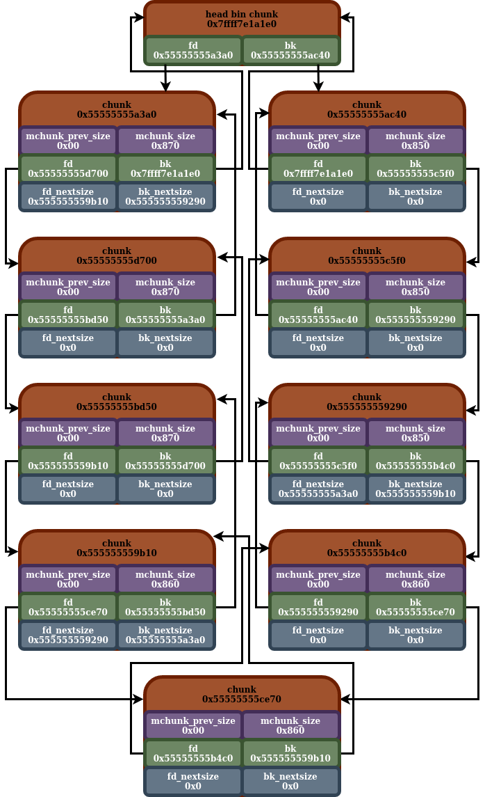
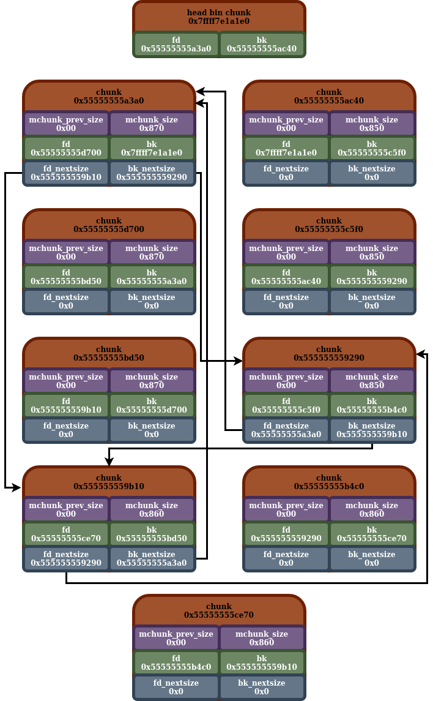

## Large Bins

- [back](readme.md)

This shares some of the attributes listed in [bins](bins.md).

The large bins consist of `63` individual bins, all of which are large bins. These take up indices `64` through `126` in the main arena bin array.

Similar to the small bins, and unsorted bin, this data structure consists of a doubly linked circular linked list. The "bin head ptr" is stored in the main arena bin array, and this is present regardless if the bin has any malloc chunks ready to be recycled into it. However, a large bin differs from both the unsorted bin and small bins in several ways.

Unlike any one of the small bins, any individual large bin is designed to hold chunks of a particular chunk size range. All of the large bins combined, are supposed to hold a vast range of chunk sizes than the small bin. Thus, in order to keep the number of bins down to a similar size, they have to have it so each bin can store a range of unique chunk sizes within it.

Now, here is a python3 function which will mimic the algorithm used to get a large bin index for a corresponding large bin size:

```
def get_largebin_index(size: int) -> int:
    if (size >> 6) <= 48:
   	 return 48 + (size >> 6)
    elif (size >> 9) <= 20:
   	 return 91 + (size >> 9)
    elif (size >> 12) <= 10:
   	 return 110 + (size >> 12)
    elif (size >> 15) <= 4:
   	 return 119 + (size >> 15)
    elif (size >> 18) <= 2:
   	 return 124 + (size >> 18)
```

And here is a chart detailing the sizes for each large bin:

| Index | Start Size | End Size |
| ----- | ----- | ----- |
| 64 | 0x400 | 0x440 |
| 65 | 0x440 | 0x480 |
| 66 | 0x480 | 0x4c0 |
| 67 | 0x4c0 | 0x500 |
| 68 | 0x500 | 0x540 |
| 69 | 0x540 | 0x580 |
| 70 | 0x580 | 0x5c0 |
| 71 | 0x5c0 | 0x600 |
| 72 | 0x600 | 0x640 |
| 73 | 0x640 | 0x680 |
| 74 | 0x680 | 0x6c0 |
| 75 | 0x6c0 | 0x700 |
| 76 | 0x700 | 0x740 |
| 77 | 0x740 | 0x780 |
| 78 | 0x780 | 0x7c0 |
| 79 | 0x7c0 | 0x800 |
| 80 | 0x800 | 0x840 |
| 81 | 0x840 | 0x880 |
| 82 | 0x880 | 0x8c0 |
| 83 | 0x8c0 | 0x900 |
| 84 | 0x900 | 0x940 |
| 85 | 0x940 | 0x980 |
| 86 | 0x980 | 0x9c0 |
| 87 | 0x9c0 | 0xa00 |
| 88 | 0xa00 | 0xa40 |
| 89 | 0xa40 | 0xa80 |
| 90 | 0xa80 | 0xac0 |
| 91 | 0xac0 | 0xb00 |
| 92 | 0xb00 | 0xb40 |
| 93 | 0xb40 | 0xb80 |
| 94 | 0xb80 | 0xbc0 |
| 95 | 0xbc0 | 0xc00 |
| 96 | 0xc00 | 0xc40 |
| 97 | 0xc40 | 0xe00 |
| 98 | 0xe00 | 0x1000 |
| 99 | 0x1000 | 0x1200 |
| 100 | 0x1200 | 0x1400 |
| 101 | 0x1400 | 0x1600 |
| 102 | 0x1600 | 0x1800 |
| 103 | 0x1800 | 0x1a00 |
| 104 | 0x1a00 | 0x1c00 |
| 105 | 0x1c00 | 0x1e00 |
| 106 | 0x1e00 | 0x2000 |
| 107 | 0x2000 | 0x2200 |
| 108 | 0x2200 | 0x2400 |
| 109 | 0x2400 | 0x2600 |
| 110 | 0x2600 | 0x2800 |
| 111 | 0x2800 | 0x2a00 |
| 112 | 0x2a00 | 0x3000 |
| 113 | 0x3000 | 0x4000 |
| 114 | 0x4000 | 0x5000 |
| 115 | 0x5000 | 0x6000 |
| 116 | 0x6000 | 0x7000 |
| 117 | 0x7000 | 0x8000 |
| 118 | 0x8000 | 0x9000 |
| 119 | 0x9000 | 0xa000 |
| 120 | 0xa000 | 0x10000 |
| 121 | 0x10000 | 0x18000 |
| 122 | 0x18000 | 0x20000 |
| 123 | 0x20000 | 0x28000 |
| 124 | 0x28000 | 0x40000 |
| 125 | 0x40000 | 0x80000 |
| 126 | 0x80000 | 0xc0000 |

The sizes for any individual large bin range between two sizes. As such, when malloc is trying to allocate a chunk from a large bin, if that large bin has a lot of chunks with a lot of different sizes, it might be a waste of space to allocate a large chunk from that bin, when a smaller bin would suffice for the requested size. As such, it will need to check the sizes of the chunks in the bin it is allocating from. To effectively do this, there is a secondary skip list data structure that resides on top of the doubly circular linked list.

## Skip List

So, a bit more about the skip list that exists in a large bin. Now, a large bin can of course, contain different chunks of different sizes. When chunks are inserted into a large bin, they are inserted in a sorted order. When it is trying to allocate a chunk from a large bin, it will iterate through the chunks in the linked list, looking for the best sized chunk to allocate for the situation. Now since it's stored in sorted order, chunks of the same size will be stored adjacent (right after each other) in the linked list. Since the primary concern when it's allocating a chunk from a large bin is the size of the chunk, if there are several chunks of the same size, it really doesn't matter which of those chunks it allocates, it just has to allocate one of them.

Now the purpose of this skip list, is to improve performance while iterating through this doubly circular linked list, by only iterating through one chunk of every unique chunk size in the bin. So effectively, it is skipping chunks of redundant sizes within the same large bin. This will probably make more sense, when you look at the diagrams below.

A bit more about the actual structure of the skip list. So, looking back again at the "large bin head ptr". The `fd` side of this node points to the largest sized chunk, and the `bk` side of this chunk points to the smallest sized chunk. For the actual chunks in the bin, that are malloc chunks which can be recycled, the `fd_nextsize` ptr (from the `malloc_chunk` view) is supposed to point to the next smallest chunk. That being said, the `bk_nextsize` ptr in any malloc chunk that is able to be recycled, should point to the next bigger sized chunk.

Now one thing about the skip list, is not all chunks will be present in the skip list. In addition to that, not all chunks will have `fd_nextsize/bk_nextsize` (skip list ptrs). This is because there just isn't a need for those chunks to have those values set, for the skip list to work as intended.

When malloc attempts to iterate through the skip list, it will start with the chunk that is pointed to by the "head bin chunk's" `fd` ptr, and begin iterating through the skip list from that chunk. Also one thing to note, the skip list is also circular, and will eventually wrap around back to the first chunk.

## Diagram

Here is a diagram, detailing an example of a large bin. The arrows show the circular doubly linked list:



Here is another diagram, of the same large bin. The arrows this time showing the skip list. I choose to have to separate diagrams, to hopefully make it a bit more readable:



Here is the exact in memory layout of the large bin depicted in those diagrams:

```
gef➤  x/10g 0x7ffff7e1a1e0
0x7ffff7e1a1e0 <main_arena+1376>:    0x7ffff7e1a1d0    0x7ffff7e1a1d0
0x7ffff7e1a1f0 <main_arena+1392>:    0x55555555a3a0    0x55555555ac40
0x7ffff7e1a200 <main_arena+1408>:    0x7ffff7e1a1f0    0x7ffff7e1a1f0
0x7ffff7e1a210 <main_arena+1424>:    0x7ffff7e1a200    0x7ffff7e1a200
0x7ffff7e1a220 <main_arena+1440>:    0x7ffff7e1a210    0x7ffff7e1a210
gef➤  x/10g 0x55555555a3a0
0x55555555a3a0:    0x0    0x871
0x55555555a3b0:    0x55555555d700    0x7ffff7e1a1e0
0x55555555a3c0:    0x555555559b10    0x555555559290
0x55555555a3d0:    0x0    0x0
0x55555555a3e0:    0x0    0x0
gef➤  x/10g 0x55555555d700
0x55555555d700:    0x0    0x871
0x55555555d710:    0x55555555bd50    0x55555555a3a0
0x55555555d720:    0x0    0x0
0x55555555d730:    0x0    0x0
0x55555555d740:    0x0    0x0
gef➤  x/10g 0x55555555bd50
0x55555555bd50:    0x0    0x871
0x55555555bd60:    0x555555559b10    0x55555555d700
0x55555555bd70:    0x0    0x0
0x55555555bd80:    0x0    0x0
0x55555555bd90:    0x0    0x0
gef➤  x/10g 0x555555559b10
0x555555559b10:    0x0    0x861
0x555555559b20:    0x55555555ce70    0x55555555bd50
0x555555559b30:    0x555555559290    0x55555555a3a0
0x555555559b40:    0x0    0x0
0x555555559b50:    0x0    0x0
gef➤  x/10g 0x55555555ce70
0x55555555ce70:    0x0    0x861
0x55555555ce80:    0x55555555b4c0    0x555555559b10
0x55555555ce90:    0x0    0x0
0x55555555cea0:    0x0    0x0
0x55555555ceb0:    0x0    0x0
gef➤  x/10g 0x55555555b4c0
0x55555555b4c0:    0x0    0x861
0x55555555b4d0:    0x555555559290    0x55555555ce70
0x55555555b4e0:    0x0    0x0
0x55555555b4f0:    0x0    0x0
0x55555555b500:    0x0    0x0
gef➤  x/10g 0x555555559290
0x555555559290:    0x0    0x851
0x5555555592a0:    0x55555555c5f0    0x55555555b4c0
0x5555555592b0:    0x55555555a3a0    0x555555559b10
0x5555555592c0:    0x0    0x0
0x5555555592d0:    0x0    0x0
gef➤  x/10g 0x55555555c5f0
0x55555555c5f0:    0x0    0x851
0x55555555c600:    0x55555555ac40    0x555555559290
0x55555555c610:    0x0    0x0
0x55555555c620:    0x0    0x0
0x55555555c630:    0x0    0x0
gef➤  x/10g 0x55555555ac40
0x55555555ac40:    0x0    0x851
0x55555555ac50:    0x7ffff7e1a1e0    0x55555555c5f0
0x55555555ac60:    0x0    0x0
0x55555555ac70:    0x0    0x0
0x55555555ac80:    0x0    0x0
gef➤  x/10g 0x7ffff7e1a1e0
0x7ffff7e1a1e0 <main_arena+1376>:    0x7ffff7e1a1d0    0x7ffff7e1a1d0
0x7ffff7e1a1f0 <main_arena+1392>:    0x55555555a3a0    0x55555555ac40
0x7ffff7e1a200 <main_arena+1408>:    0x7ffff7e1a1f0    0x7ffff7e1a1f0
0x7ffff7e1a210 <main_arena+1424>:    0x7ffff7e1a200    0x7ffff7e1a200
0x7ffff7e1a220 <main_arena+1440>:    0x7ffff7e1a210    0x7ffff7e1a210
```

## Skip List Insertion (Free)

So, there are three instances, we will cover:

    *    Inserting a chunk into an empty large bin
    *    Inserting a chunk that is smaller than the smallest chunk in the large bin
    *    Inserting a chunk (not the smallest), will not need to update the skip list
    *    Inserting a chunk (not the smallest), skip list will need to be updated

#### Inserting Empty large Bin

So here, we are going to look at what it looks like when a large bin gets inserted into an empty large bin. We see that before, the bin head ptr just points to itself. After it is inserted, we see that both the `fd` and `bk` ptrs of the bin head chunk point to the single malloc chunk in the bin. We also see that the skip list only has one node in it (the single malloc chunk), and just points to itself:

Before:
```
gef➤  x/10g 0x7ffff7e1a1e0
0x7ffff7e1a1e0 <main_arena+1376>:    0x7ffff7e1a1d0    0x7ffff7e1a1d0
0x7ffff7e1a1f0 <main_arena+1392>:    0x7ffff7e1a1e0    0x7ffff7e1a1e0
0x7ffff7e1a200 <main_arena+1408>:    0x7ffff7e1a1f0    0x7ffff7e1a1f0
0x7ffff7e1a210 <main_arena+1424>:    0x7ffff7e1a200    0x7ffff7e1a200
0x7ffff7e1a220 <main_arena+1440>:    0x7ffff7e1a210    0x7ffff7e1a210
```

After:
```
gef➤  x/10g 0x7ffff7e1a1e0
0x7ffff7e1a1e0 <main_arena+1376>:    0x7ffff7e1a1d0    0x7ffff7e1a1d0
0x7ffff7e1a1f0 <main_arena+1392>:    0x555555559290    0x555555559290
0x7ffff7e1a200 <main_arena+1408>:    0x7ffff7e1a1f0    0x7ffff7e1a1f0
0x7ffff7e1a210 <main_arena+1424>:    0x7ffff7e1a200    0x7ffff7e1a200
0x7ffff7e1a220 <main_arena+1440>:    0x7ffff7e1a210    0x7ffff7e1a210
gef➤  x/10g 0x555555559290
0x555555559290:    0x0    0x851
0x5555555592a0:    0x7ffff7e1a1e0    0x7ffff7e1a1e0
0x5555555592b0:    0x555555559290    0x555555559290
0x5555555592c0:    0x0    0x0
0x5555555592d0:    0x0    0x0
```

#### Inserting Smallest Chunk

So here, we see an example, where the chunk being inserted into a large bin is smaller (size `0x840`) than all of the chunks currently present in the large bin. What happens is, the `bk` ptr for the bin head chunk gets set to the new smallest chunk. In addition to that, the skip list is updated, to include the new chunk size.

Before:
```
gef➤  x/10g 0x7ffff7e1a1e0
0x7ffff7e1a1e0 <main_arena+1376>:    0x7ffff7e1a1d0    0x7ffff7e1a1d0
0x7ffff7e1a1f0 <main_arena+1392>:    0x55555555a3a0    0x555555559290
0x7ffff7e1a200 <main_arena+1408>:    0x7ffff7e1a1f0    0x7ffff7e1a1f0
0x7ffff7e1a210 <main_arena+1424>:    0x7ffff7e1a200    0x7ffff7e1a200
0x7ffff7e1a220 <main_arena+1440>:    0x7ffff7e1a210    0x7ffff7e1a210
gef➤  x/10g 0x55555555a3a0
0x55555555a3a0:    0x0    0x871
0x55555555a3b0:    0x555555559b10    0x7ffff7e1a1e0
0x55555555a3c0:    0x555555559b10    0x555555559290
0x55555555a3d0:    0x0    0x0
0x55555555a3e0:    0x0    0x0
gef➤  x/10g 0x555555559b10
0x555555559b10:    0x0    0x861
0x555555559b20:    0x555555559290    0x55555555a3a0
0x555555559b30:    0x555555559290    0x55555555a3a0
0x555555559b40:    0x0    0x0
0x555555559b50:    0x0    0x0
gef➤  x/10g 0x555555559290
0x555555559290:    0x0    0x851
0x5555555592a0:    0x7ffff7e1a1e0    0x555555559b10
0x5555555592b0:    0x55555555a3a0    0x555555559b10
0x5555555592c0:    0x0    0x0
0x5555555592d0:    0x0    0x0
gef➤  x/10g 0x7ffff7e1a1e0
0x7ffff7e1a1e0 <main_arena+1376>:    0x7ffff7e1a1d0    0x7ffff7e1a1d0
0x7ffff7e1a1f0 <main_arena+1392>:    0x55555555a3a0    0x555555559290
0x7ffff7e1a200 <main_arena+1408>:    0x7ffff7e1a1f0    0x7ffff7e1a1f0
0x7ffff7e1a210 <main_arena+1424>:    0x7ffff7e1a200    0x7ffff7e1a200
0x7ffff7e1a220 <main_arena+1440>:    0x7ffff7e1a210    0x7ffff7e1a210
```

After:
```
gef➤  x/10g 0x7ffff7e1a1e0
0x7ffff7e1a1e0 <main_arena+1376>:    0x7ffff7e1a1d0    0x7ffff7e1a1d0
0x7ffff7e1a1f0 <main_arena+1392>:    0x55555555a3a0    0x55555555ac40
0x7ffff7e1a200 <main_arena+1408>:    0x7ffff7e1a1f0    0x7ffff7e1a1f0
0x7ffff7e1a210 <main_arena+1424>:    0x7ffff7e1a200    0x7ffff7e1a200
0x7ffff7e1a220 <main_arena+1440>:    0x7ffff7e1a210    0x7ffff7e1a210
gef➤  x/10g 0x55555555a3a0
0x55555555a3a0:    0x0    0x871
0x55555555a3b0:    0x555555559b10    0x7ffff7e1a1e0
0x55555555a3c0:    0x555555559b10    0x55555555ac40
0x55555555a3d0:    0x0    0x0
0x55555555a3e0:    0x0    0x0
gef➤  x/10g 0x555555559b10
0x555555559b10:    0x0    0x861
0x555555559b20:    0x555555559290    0x55555555a3a0
0x555555559b30:    0x555555559290    0x55555555a3a0
0x555555559b40:    0x0    0x0
0x555555559b50:    0x0    0x0
gef➤  x/10g 0x555555559290
0x555555559290:    0x0    0x851
0x5555555592a0:    0x55555555ac40    0x555555559b10
0x5555555592b0:    0x55555555ac40    0x555555559b10
0x5555555592c0:    0x0    0x0
0x5555555592d0:    0x0    0x0
gef➤  x/10g 0x55555555ac40
0x55555555ac40:    0x0    0x841
0x55555555ac50:    0x7ffff7e1a1e0    0x555555559290
0x55555555ac60:    0x55555555a3a0    0x555555559290
0x55555555ac70:    0x0    0x0
0x55555555ac80:    0x0    0x0
gef➤  x/10g 0x7ffff7e1a1e0
0x7ffff7e1a1e0 <main_arena+1376>:    0x7ffff7e1a1d0    0x7ffff7e1a1d0
0x7ffff7e1a1f0 <main_arena+1392>:    0x55555555a3a0    0x55555555ac40
0x7ffff7e1a200 <main_arena+1408>:    0x7ffff7e1a1f0    0x7ffff7e1a1f0
0x7ffff7e1a210 <main_arena+1424>:    0x7ffff7e1a200    0x7ffff7e1a200
0x7ffff7e1a220 <main_arena+1440>:    0x7ffff7e1a210    0x7ffff7e1a210
```

#### Inserting a Chunk, Not Updating Skip List

So here we have an instance where a chunk is being inserted into a large bin that already has chunks with the same size (`0x860`). Since the unique sizes that the large bin has didn't change, the skip list doesn't need to be updated.

Before:

```
gef➤  x/10g 0x7ffff7e1a1e0
0x7ffff7e1a1e0 <main_arena+1376>:    0x7ffff7e1a1d0    0x7ffff7e1a1d0
0x7ffff7e1a1f0 <main_arena+1392>:    0x55555555a3a0    0x555555559290
0x7ffff7e1a200 <main_arena+1408>:    0x7ffff7e1a1f0    0x7ffff7e1a1f0
0x7ffff7e1a210 <main_arena+1424>:    0x7ffff7e1a200    0x7ffff7e1a200
0x7ffff7e1a220 <main_arena+1440>:    0x7ffff7e1a210    0x7ffff7e1a210
gef➤  x/10g 0x55555555a3a0
0x55555555a3a0:    0x0    0x871
0x55555555a3b0:    0x555555559b10    0x7ffff7e1a1e0
0x55555555a3c0:    0x555555559b10    0x555555559290
0x55555555a3d0:    0x0    0x0
0x55555555a3e0:    0x0    0x0
gef➤  x/10g 0x555555559b10
0x555555559b10:    0x0    0x861
0x555555559b20:    0x555555559290    0x55555555a3a0
0x555555559b30:    0x555555559290    0x55555555a3a0
0x555555559b40:    0x0    0x0
0x555555559b50:    0x0    0x0
gef➤  x/10g 0x555555559290
0x555555559290:    0x0    0x851
0x5555555592a0:    0x7ffff7e1a1e0    0x555555559b10
0x5555555592b0:    0x55555555a3a0    0x555555559b10
0x5555555592c0:    0x0    0x0
0x5555555592d0:    0x0    0x0
gef➤  x/10g 0x7ffff7e1a1e0
0x7ffff7e1a1e0 <main_arena+1376>:    0x7ffff7e1a1d0    0x7ffff7e1a1d0
0x7ffff7e1a1f0 <main_arena+1392>:    0x55555555a3a0    0x555555559290
0x7ffff7e1a200 <main_arena+1408>:    0x7ffff7e1a1f0    0x7ffff7e1a1f0
0x7ffff7e1a210 <main_arena+1424>:    0x7ffff7e1a200    0x7ffff7e1a200
0x7ffff7e1a220 <main_arena+1440>:    0x7ffff7e1a210    0x7ffff7e1a210
```

After:

```
gef➤  x/10g 0x7ffff7e1a1e0
0x7ffff7e1a1e0 <main_arena+1376>:    0x7ffff7e1a1d0    0x7ffff7e1a1d0
0x7ffff7e1a1f0 <main_arena+1392>:    0x55555555a3a0    0x555555559290
0x7ffff7e1a200 <main_arena+1408>:    0x7ffff7e1a1f0    0x7ffff7e1a1f0
0x7ffff7e1a210 <main_arena+1424>:    0x7ffff7e1a200    0x7ffff7e1a200
0x7ffff7e1a220 <main_arena+1440>:    0x7ffff7e1a210    0x7ffff7e1a210
gef➤  x/10g 0x55555555a3a0
0x55555555a3a0:    0x0    0x871
0x55555555a3b0:    0x555555559b10    0x7ffff7e1a1e0
0x55555555a3c0:    0x555555559b10    0x555555559290
0x55555555a3d0:    0x0    0x0
0x55555555a3e0:    0x0    0x0
gef➤  x/10g 0x555555559b10
0x555555559b10:    0x0    0x861
0x555555559b20:    0x55555555ac40    0x55555555a3a0
0x555555559b30:    0x555555559290    0x55555555a3a0
0x555555559b40:    0x0    0x0
0x555555559b50:    0x0    0x0
gef➤  x/10g 0x55555555ac40
0x55555555ac40:    0x0    0x861
0x55555555ac50:    0x555555559290    0x555555559b10
0x55555555ac60:    0x0    0x0
0x55555555ac70:    0x0    0x0
0x55555555ac80:    0x0    0x0
gef➤  x/10g 0x555555559290
0x555555559290:    0x0    0x851
0x5555555592a0:    0x7ffff7e1a1e0    0x55555555ac40
0x5555555592b0:    0x55555555a3a0    0x555555559b10
0x5555555592c0:    0x0    0x0
0x5555555592d0:    0x0    0x0
gef➤  x/10g 0x7ffff7e1a1e0
0x7ffff7e1a1e0 <main_arena+1376>:    0x7ffff7e1a1d0    0x7ffff7e1a1d0
0x7ffff7e1a1f0 <main_arena+1392>:    0x55555555a3a0    0x555555559290
0x7ffff7e1a200 <main_arena+1408>:    0x7ffff7e1a1f0    0x7ffff7e1a1f0
0x7ffff7e1a210 <main_arena+1424>:    0x7ffff7e1a200    0x7ffff7e1a200
0x7ffff7e1a220 <main_arena+1440>:    0x7ffff7e1a210    0x7ffff7e1a210
```

#### Inserting a Chunk, Updating Skip List

So here, we have an example where a malloc chunk is being inserted into a large bin, that adds a new unique size (`0x860`) to the large bin. As it gets inserted, the skip list will have to be updated to reflect the new unique size, while also maintaining a sorted order.

Before:

```
gef➤  x/10g 0x7ffff7e1a1e0
0x7ffff7e1a1e0 <main_arena+1376>:    0x7ffff7e1a1d0    0x7ffff7e1a1d0
0x7ffff7e1a1f0 <main_arena+1392>:    0x555555559b10    0x555555559290
0x7ffff7e1a200 <main_arena+1408>:    0x7ffff7e1a1f0    0x7ffff7e1a1f0
0x7ffff7e1a210 <main_arena+1424>:    0x7ffff7e1a200    0x7ffff7e1a200
0x7ffff7e1a220 <main_arena+1440>:    0x7ffff7e1a210    0x7ffff7e1a210
gef➤  x/10g 0x555555559b10
0x555555559b10:    0x0    0x871
0x555555559b20:    0x555555559290    0x7ffff7e1a1e0
0x555555559b30:    0x555555559290    0x555555559290
0x555555559b40:    0x0    0x0
0x555555559b50:    0x0    0x0
gef➤  x/10g 0x555555559290
0x555555559290:    0x0    0x851
0x5555555592a0:    0x7ffff7e1a1e0    0x555555559b10
0x5555555592b0:    0x555555559b10    0x555555559b10
0x5555555592c0:    0x0    0x0
0x5555555592d0:    0x0    0x0
gef➤  x/10g 0x7ffff7e1a1e0
0x7ffff7e1a1e0 <main_arena+1376>:    0x7ffff7e1a1d0    0x7ffff7e1a1d0
0x7ffff7e1a1f0 <main_arena+1392>:    0x555555559b10    0x555555559290
0x7ffff7e1a200 <main_arena+1408>:    0x7ffff7e1a1f0    0x7ffff7e1a1f0
0x7ffff7e1a210 <main_arena+1424>:    0x7ffff7e1a200    0x7ffff7e1a200
0x7ffff7e1a220 <main_arena+1440>:    0x7ffff7e1a210    0x7ffff7e1a210
```

After:

```
gef➤  x/10g 0x7ffff7e1a1e0
0x7ffff7e1a1e0 <main_arena+1376>:    0x7ffff7e1a1d0    0x7ffff7e1a1d0
0x7ffff7e1a1f0 <main_arena+1392>:    0x555555559b10    0x555555559290
0x7ffff7e1a200 <main_arena+1408>:    0x7ffff7e1a1f0    0x7ffff7e1a1f0
0x7ffff7e1a210 <main_arena+1424>:    0x7ffff7e1a200    0x7ffff7e1a200
0x7ffff7e1a220 <main_arena+1440>:    0x7ffff7e1a210    0x7ffff7e1a210
gef➤  x/10g 0x555555559b10
0x555555559b10:    0x0    0x871
0x555555559b20:    0x55555555a3b0    0x7ffff7e1a1e0
0x555555559b30:    0x55555555a3b0    0x555555559290
0x555555559b40:    0x0    0x0
0x555555559b50:    0x0    0x0
gef➤  x/10g 0x55555555a3b0
0x55555555a3b0:    0x0    0x861
0x55555555a3c0:    0x555555559290    0x555555559b10
0x55555555a3d0:    0x555555559290    0x555555559b10
0x55555555a3e0:    0x0    0x0
0x55555555a3f0:    0x0    0x0
gef➤  x/10g 0x555555559290
0x555555559290:    0x0    0x851
0x5555555592a0:    0x7ffff7e1a1e0    0x55555555a3b0
0x5555555592b0:    0x555555559b10    0x55555555a3b0
0x5555555592c0:    0x0    0x0
0x5555555592d0:    0x0    0x0
gef➤  x/10g 0x7ffff7e1a1e0
0x7ffff7e1a1e0 <main_arena+1376>:    0x7ffff7e1a1d0    0x7ffff7e1a1d0
0x7ffff7e1a1f0 <main_arena+1392>:    0x555555559b10    0x555555559290
0x7ffff7e1a200 <main_arena+1408>:    0x7ffff7e1a1f0    0x7ffff7e1a1f0
0x7ffff7e1a210 <main_arena+1424>:    0x7ffff7e1a200    0x7ffff7e1a200
0x7ffff7e1a220 <main_arena+1440>:    0x7ffff7e1a210    0x7ffff7e1a210
```

## Skip List Removal (Malloc)

So, there are three instances, we will cover:

    *    Removing last chunk from a large bin
    *    Removing a chunk from a large bin, skip list will need to be updated
    *    Removing a chunk from a large bin, skip list will not need to be updated

#### Removing Last Chunk from Large Bin

So here, we will see an example where the last chunk of a large bin get's removed. After that, we see a generic empty head bin chunk.

Before:
```
gef➤  x/10g 0x7ffff7e1a1e0
0x7ffff7e1a1e0 <main_arena+1376>:    0x7ffff7e1a1d0    0x7ffff7e1a1d0
0x7ffff7e1a1f0 <main_arena+1392>:    0x555555559290    0x555555559290
0x7ffff7e1a200 <main_arena+1408>:    0x7ffff7e1a1f0    0x7ffff7e1a1f0
0x7ffff7e1a210 <main_arena+1424>:    0x7ffff7e1a200    0x7ffff7e1a200
0x7ffff7e1a220 <main_arena+1440>:    0x7ffff7e1a210    0x7ffff7e1a210
gef➤  x/10g 0x555555559290
0x555555559290:    0x0    0x851
0x5555555592a0:    0x7ffff7e1a1e0    0x7ffff7e1a1e0
0x5555555592b0:    0x555555559290    0x555555559290
0x5555555592c0:    0x0    0x0
0x5555555592d0:    0x0    0x0
```

After:
```
gef➤  x/10g 0x7ffff7e1a1e0
0x7ffff7e1a1e0 <main_arena+1376>:    0x7ffff7e1a1d0    0x7ffff7e1a1d0
0x7ffff7e1a1f0 <main_arena+1392>:    0x7ffff7e1a1e0    0x7ffff7e1a1e0
0x7ffff7e1a200 <main_arena+1408>:    0x7ffff7e1a1f0    0x7ffff7e1a1f0
0x7ffff7e1a210 <main_arena+1424>:    0x7ffff7e1a200    0x7ffff7e1a200
0x7ffff7e1a220 <main_arena+1440>:    0x7ffff7e1a210    0x7ffff7e1a210
```

#### Removing Chunk from Large Bin, Update Skip List

So in this instance, we are removing a chunk of size `0x860`. There is only one chunk in the large bin with that size. As such, after it gets removed, the number of unique sizes present in the large bin will be less. As such, the skip list will need to be updated to no longer include that, as well as the circular doubly linked list.

Before:
```
gef➤  x/10g 0x7ffff7e1a1e0
0x7ffff7e1a1e0 <main_arena+1376>:    0x7ffff7e1a1d0    0x7ffff7e1a1d0
0x7ffff7e1a1f0 <main_arena+1392>:    0x55555555a3a0    0x555555559290
0x7ffff7e1a200 <main_arena+1408>:    0x7ffff7e1a1f0    0x7ffff7e1a1f0
0x7ffff7e1a210 <main_arena+1424>:    0x7ffff7e1a200    0x7ffff7e1a200
0x7ffff7e1a220 <main_arena+1440>:    0x7ffff7e1a210    0x7ffff7e1a210
gef➤  x/10g 0x55555555a3a0
0x55555555a3a0:    0x0    0x871
0x55555555a3b0:    0x555555559b10    0x7ffff7e1a1e0
0x55555555a3c0:    0x555555559b10    0x555555559290
0x55555555a3d0:    0x0    0x0
0x55555555a3e0:    0x0    0x0
gef➤  x/10g 0x555555559b10
0x555555559b10:    0x0    0x861
0x555555559b20:    0x555555559290    0x55555555a3a0
0x555555559b30:    0x555555559290    0x55555555a3a0
0x555555559b40:    0x0    0x0
0x555555559b50:    0x0    0x0
gef➤  x/10g 0x555555559290
0x555555559290:    0x0    0x851
0x5555555592a0:    0x7ffff7e1a1e0    0x555555559b10
0x5555555592b0:    0x55555555a3a0    0x555555559b10
0x5555555592c0:    0x0    0x0
0x5555555592d0:    0x0    0x0
gef➤  x/10g 0x7ffff7e1a1e0
0x7ffff7e1a1e0 <main_arena+1376>:    0x7ffff7e1a1d0    0x7ffff7e1a1d0
0x7ffff7e1a1f0 <main_arena+1392>:    0x55555555a3a0    0x555555559290
0x7ffff7e1a200 <main_arena+1408>:    0x7ffff7e1a1f0    0x7ffff7e1a1f0
0x7ffff7e1a210 <main_arena+1424>:    0x7ffff7e1a200    0x7ffff7e1a200
0x7ffff7e1a220 <main_arena+1440>:    0x7ffff7e1a210    0x7ffff7e1a210
```

After:
```
gef➤  x/10g 0x7ffff7e1a1e0
0x7ffff7e1a1e0 <main_arena+1376>:    0x7ffff7e1a1d0    0x7ffff7e1a1d0
0x7ffff7e1a1f0 <main_arena+1392>:    0x55555555a3a0    0x555555559290
0x7ffff7e1a200 <main_arena+1408>:    0x7ffff7e1a1f0    0x7ffff7e1a1f0
0x7ffff7e1a210 <main_arena+1424>:    0x7ffff7e1a200    0x7ffff7e1a200
0x7ffff7e1a220 <main_arena+1440>:    0x7ffff7e1a210    0x7ffff7e1a210
gef➤  x/10g 0x55555555a3a0
0x55555555a3a0:    0x0    0x871
0x55555555a3b0:    0x555555559290    0x7ffff7e1a1e0
0x55555555a3c0:    0x555555559290    0x555555559290
0x55555555a3d0:    0x0    0x0
0x55555555a3e0:    0x0    0x0
gef➤  x/10g 0x555555559290
0x555555559290:    0x0    0x851
0x5555555592a0:    0x7ffff7e1a1e0    0x55555555a3a0
0x5555555592b0:    0x55555555a3a0    0x55555555a3a0
0x5555555592c0:    0x0    0x0
0x5555555592d0:    0x0    0x0
gef➤  x/10g 0x7ffff7e1a1e0
0x7ffff7e1a1e0 <main_arena+1376>:    0x7ffff7e1a1d0    0x7ffff7e1a1d0
0x7ffff7e1a1f0 <main_arena+1392>:    0x55555555a3a0    0x555555559290
0x7ffff7e1a200 <main_arena+1408>:    0x7ffff7e1a1f0    0x7ffff7e1a1f0
0x7ffff7e1a210 <main_arena+1424>:    0x7ffff7e1a200    0x7ffff7e1a200
0x7ffff7e1a220 <main_arena+1440>:    0x7ffff7e1a210    0x7ffff7e1a210
```

#### Removing Chunk from Large Bin, Don't Update Skip List

Here, we have an instance where we are removing a chunk (`0x55555555b4c0`) from the large bin, with a size of `0x860`. Now, there are multiple chunks with that size in this large bin, so the skip list will not need to be updated. Only the circular doubly linked list will need to be updated. Also one thing to note, when it is allocating a chunk from a large bin that has multiple chunks with the same size, it will try to allocate a chunk that isn't present in the skip list (since then it would need to update the skip list if it removed a chunk in the skip list).

Before:
```
gef➤  x/10g 0x7ffff7e1a1e0
0x7ffff7e1a1e0 <main_arena+1376>:    0x7ffff7e1a1d0    0x7ffff7e1a1d0
0x7ffff7e1a1f0 <main_arena+1392>:    0x55555555a3a0    0x55555555ac40
0x7ffff7e1a200 <main_arena+1408>:    0x7ffff7e1a1f0    0x7ffff7e1a1f0
0x7ffff7e1a210 <main_arena+1424>:    0x7ffff7e1a200    0x7ffff7e1a200
0x7ffff7e1a220 <main_arena+1440>:    0x7ffff7e1a210    0x7ffff7e1a210
gef➤  x/10g 0x55555555a3a0
0x55555555a3a0:    0x0    0x871
0x55555555a3b0:    0x55555555bd50    0x7ffff7e1a1e0
0x55555555a3c0:    0x555555559b10    0x555555559290
0x55555555a3d0:    0x0    0x0
0x55555555a3e0:    0x0    0x0
gef➤  x/10g 0x55555555bd50
0x55555555bd50:    0x0    0x871
0x55555555bd60:    0x555555559b10    0x55555555a3a0
0x55555555bd70:    0x0    0x0
0x55555555bd80:    0x0    0x0
0x55555555bd90:    0x0    0x0
gef➤  x/10g 0x555555559b10
0x555555559b10:    0x0    0x861
0x555555559b20:    0x55555555b4c0    0x55555555bd50
0x555555559b30:    0x555555559290    0x55555555a3a0
0x555555559b40:    0x0    0x0
0x555555559b50:    0x0    0x0
gef➤  x/10g 0x55555555b4c0
0x55555555b4c0:    0x0    0x861
0x55555555b4d0:    0x555555559290    0x555555559b10
0x55555555b4e0:    0x0    0x0
0x55555555b4f0:    0x0    0x0
0x55555555b500:    0x0    0x0
gef➤  x/10g 0x555555559290
0x555555559290:    0x0    0x851
0x5555555592a0:    0x55555555ac40    0x55555555b4c0
0x5555555592b0:    0x55555555a3a0    0x555555559b10
0x5555555592c0:    0x0    0x0
0x5555555592d0:    0x0    0x0
gef➤  x/10g 0x55555555ac40
0x55555555ac40:    0x0    0x851
0x55555555ac50:    0x7ffff7e1a1e0    0x555555559290
0x55555555ac60:    0x0    0x0
0x55555555ac70:    0x0    0x0
0x55555555ac80:    0x0    0x0
gef➤  x/10g 0x7ffff7e1a1e0
0x7ffff7e1a1e0 <main_arena+1376>:    0x7ffff7e1a1d0    0x7ffff7e1a1d0
0x7ffff7e1a1f0 <main_arena+1392>:    0x55555555a3a0    0x55555555ac40
0x7ffff7e1a200 <main_arena+1408>:    0x7ffff7e1a1f0    0x7ffff7e1a1f0
0x7ffff7e1a210 <main_arena+1424>:    0x7ffff7e1a200    0x7ffff7e1a200
0x7ffff7e1a220 <main_arena+1440>:    0x7ffff7e1a210    0x7ffff7e1a210
```

After:
```
gef➤  x/10g 0x7ffff7e1a1e0
0x7ffff7e1a1e0 <main_arena+1376>:    0x7ffff7e1a1d0    0x7ffff7e1a1d0
0x7ffff7e1a1f0 <main_arena+1392>:    0x55555555a3a0    0x55555555ac40
0x7ffff7e1a200 <main_arena+1408>:    0x7ffff7e1a1f0    0x7ffff7e1a1f0
0x7ffff7e1a210 <main_arena+1424>:    0x7ffff7e1a200    0x7ffff7e1a200
0x7ffff7e1a220 <main_arena+1440>:    0x7ffff7e1a210    0x7ffff7e1a210
gef➤  x/10g 0x55555555a3a0
0x55555555a3a0:    0x0    0x871
0x55555555a3b0:    0x55555555bd50    0x7ffff7e1a1e0
0x55555555a3c0:    0x555555559b10    0x555555559290
0x55555555a3d0:    0x0    0x0
0x55555555a3e0:    0x0    0x0
gef➤  x/10g 0x55555555bd50
0x55555555bd50:    0x0    0x871
0x55555555bd60:    0x555555559b10    0x55555555a3a0
0x55555555bd70:    0x0    0x0
0x55555555bd80:    0x0    0x0
0x55555555bd90:    0x0    0x0
gef➤  x/10g 0x555555559b10
0x555555559b10:    0x0    0x861
0x555555559b20:    0x555555559290    0x55555555bd50
0x555555559b30:    0x555555559290    0x55555555a3a0
0x555555559b40:    0x0    0x0
0x555555559b50:    0x0    0x0
gef➤  x/10g 0x555555559290
0x555555559290:    0x0    0x851
0x5555555592a0:    0x55555555ac40    0x555555559b10
0x5555555592b0:    0x55555555a3a0    0x555555559b10
0x5555555592c0:    0x0    0x0
0x5555555592d0:    0x0    0x0
gef➤  x/10g 0x55555555ac40
0x55555555ac40:    0x0    0x851
0x55555555ac50:    0x7ffff7e1a1e0    0x555555559290
0x55555555ac60:    0x0    0x0
0x55555555ac70:    0x0    0x0
0x55555555ac80:    0x0    0x0
gef➤  x/10g 0x7ffff7e1a1e0
0x7ffff7e1a1e0 <main_arena+1376>:    0x7ffff7e1a1d0    0x7ffff7e1a1d0
0x7ffff7e1a1f0 <main_arena+1392>:    0x55555555a3a0    0x55555555ac40
0x7ffff7e1a200 <main_arena+1408>:    0x7ffff7e1a1f0    0x7ffff7e1a1f0
0x7ffff7e1a210 <main_arena+1424>:    0x7ffff7e1a200    0x7ffff7e1a200
0x7ffff7e1a220 <main_arena+1440>:    0x7ffff7e1a210    0x7ffff7e1a210
```


