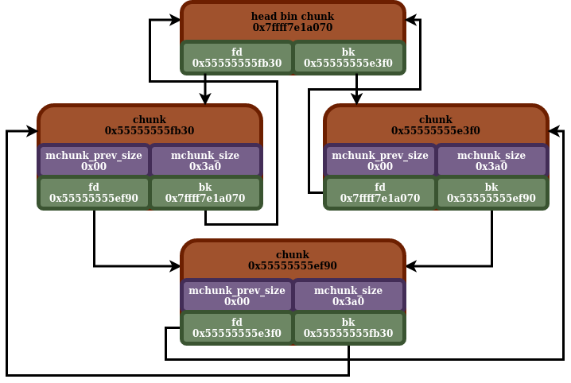
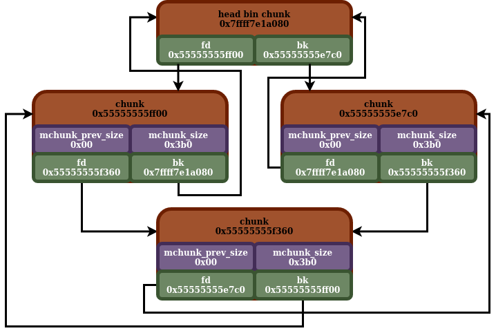

## Small Bins

- [back](readme.md)

This shares some of the attributes listed in [bins](bins.md).

So, the small bins comprise `62` different bins. In the main arena bin array, it comprises indices `2` through `63`.

This is another mechanism, used to recycle freed malloc chunks. It differs from and is similar to other binning mechanisms in a few different ways. First off, all of the chunks that get inserted into any small bin, must first be inserted into, and removed from the unsorted bin. Secondly each bin is designed to hold chunks of a particular size (malloc rounds up chunks to the nearest `0x10` divisible size, so chunk user size of `0x55` and `0x56` would end up with the same actual chunk size).

Similar to the unsorted bin, and large bins, each small bin is composed of a circular doubly linked list. The node stored in the main arena is the "bin head chunk". It will be present there, even if there are no malloc chunks to be recycled in the bin.

Now, each bin is supposed to hold chunks of a particular size. The mapping between small bin size, and small bin index (which maps to a particular small bin). You just shift the size / index by `4` bits, which we can see with these python3 functions. To get the index from the size, you shift the size over to the right by `4` bits. To get the size from the index, you shift the index over to the left by `4` bits.

```
def get_index_from_size(size: int) -> int:
    return (size >> 4)

def get_size_from_index(index: int) -> int:
    return (index << 4)
```

Here is a chart describing the sizes:

| Index | Size |
| ---- | ---- |
| 2 | 0x20 |
| 3 | 0x30 |
| 4 | 0x40 |
| 5 | 0x50 |
| 6 | 0x60 |
| 7 | 0x70 |
| 8 | 0x80 |
| 9 | 0x90 |
| 10 | 0xa0 |
| 11 | 0xb0 |
| 12 | 0xc0 |
| 13 | 0xd0 |
| 14 | 0xe0 |
| 15 | 0xf0 |
| 16 | 0x100 |
| 17 | 0x110 |
| 18 | 0x120 |
| 19 | 0x130 |
| 20 | 0x140 |
| 21 | 0x150 |
| 22 | 0x160 |
| 23 | 0x170 |
| 24 | 0x180 |
| 25 | 0x190 |
| 26 | 0x1a0 |
| 27 | 0x1b0 |
| 28 | 0x1c0 |
| 29 | 0x1d0 |
| 30 | 0x1e0 |
| 31 | 0x1f0 |
| 32 | 0x200 |
| 33 | 0x210 |
| 34 | 0x220 |
| 35 | 0x230 |
| 36 | 0x240 |
| 37 | 0x250 |
| 38 | 0x260 |
| 39 | 0x270 |
| 40 | 0x280 |
| 41 | 0x290 |
| 42 | 0x2a0 |
| 43 | 0x2b0 |
| 44 | 0x2c0 |
| 45 | 0x2d0 |
| 46 | 0x2e0 |
| 47 | 0x2f0 |
| 48 | 0x300 |
| 49 | 0x310 |
| 50 | 0x320 |
| 51 | 0x330 |
| 52 | 0x340 |
| 53 | 0x350 |
| 54 | 0x360 |
| 55 | 0x370 |
| 56 | 0x380 |
| 57 | 0x390 |
| 58 | 0x3a0 |
| 59 | 0x3b0 |
| 60 | 0x3c0 |
| 61 | 0x3d0 |
| 62 | 0x3e0 |
| 63 | 0x3f0 |

So, we can see the minimum size for a small bin is `0x20`, and the largest size is `0x3f0`. Also, we can see that these sizes overlap with some of the sizes for the tcache, and fastbins. Traditionally chunks of these sizes will be inserted (or allocated from) those mechanisms first, prior to ending up in the small bin. Also, one thing we do see, if the tcache is enabled and a chunk is allocated from the small bin, it will attempt to move chunks over from the small bin to the tcache.

Similar to the unsorted bin, and large bins, insertions will happen at the `fd` (head) end of the "bin head chunk" and removals happen at the `bk` end (tail).

Here is a diagram of some small bins. It looks almost identical to the small bin, except that each bin contains chunks of the same size:





Here is the in memory layout of those same small bins:

```
gef➤  x/10g 0x7ffff7e1a070
0x7ffff7e1a070 <main_arena+1008>:   0x7ffff7e1a060  0x7ffff7e1a060
0x7ffff7e1a080 <main_arena+1024>:   0x55555555fb30  0x55555555e3f0
0x7ffff7e1a090 <main_arena+1040>:   0x55555555ff00  0x55555555e7c0
0x7ffff7e1a0a0 <main_arena+1056>:   0x5555555602e0  0x55555555eba0
0x7ffff7e1a0b0 <main_arena+1072>:   0x7ffff7e1a0a0  0x7ffff7e1a0a0
gef➤  x/10g 0x55555555fb30
0x55555555fb30: 0x0 0x3a1
0x55555555fb40: 0x55555555ef90  0x7ffff7e1a070
0x55555555fb50: 0x0 0x0
0x55555555fb60: 0x0 0x0
0x55555555fb70: 0x0 0x0
gef➤  x/10g 0x55555555ef90
0x55555555ef90: 0x0 0x3a1
0x55555555efa0: 0x55555555e3f0  0x55555555fb30
0x55555555efb0: 0x0 0x0
0x55555555efc0: 0x0 0x0
0x55555555efd0: 0x0 0x0
gef➤  x/10g 0x55555555e3f0
0x55555555e3f0: 0x0 0x3a1
0x55555555e400: 0x7ffff7e1a070  0x55555555ef90
0x55555555e410: 0x0 0x0
0x55555555e420: 0x0 0x0
0x55555555e430: 0x0 0x0
gef➤  x/10g 0x55555555ff00
0x55555555ff00: 0x0 0x3b1
0x55555555ff10: 0x55555555f360  0x7ffff7e1a080
0x55555555ff20: 0x0 0x0
0x55555555ff30: 0x0 0x0
0x55555555ff40: 0x0 0x0
gef➤  x/10g 0x55555555f360
0x55555555f360: 0x0 0x3b1
0x55555555f370: 0x55555555e7c0  0x55555555ff00
0x55555555f380: 0x0 0x0
0x55555555f390: 0x0 0x0
0x55555555f3a0: 0x0 0x0
gef➤  x/10g 0x55555555e7c0
0x55555555e7c0: 0x0 0x3b1
0x55555555e7d0: 0x7ffff7e1a080  0x55555555f360
0x55555555e7e0: 0x0 0x0
0x55555555e7f0: 0x0 0x0
0x55555555e800: 0x0 0x0
gef➤  x/10g 0x5555555602e0
0x5555555602e0: 0x0 0x3c1
0x5555555602f0: 0x55555555f740  0x7ffff7e1a090
0x555555560300: 0x0 0x0
0x555555560310: 0x0 0x0
0x555555560320: 0x0 0x0
gef➤  x/10g 0x55555555f740
0x55555555f740: 0x0 0x3c1
0x55555555f750: 0x55555555eba0  0x5555555602e0
0x55555555f760: 0x0 0x0
0x55555555f770: 0x0 0x0
0x55555555f780: 0x0 0x0
gef➤  x/10g 0x55555555eba0
0x55555555eba0: 0x0 0x3c1
0x55555555ebb0: 0x7ffff7e1a090  0x55555555f740
0x55555555ebc0: 0x0 0x0
0x55555555ebd0: 0x0 0x0
0x55555555ebe0: 0x0 0x0
```

## Small Bin Insertion Example

So here, we are going to cover an example where a new malloc chunk is being inserted into a small bin that already has chunks in it. Insertions are made at the head (`fd` end of the "bin head chunk"), as we see here (the chunk being inserted is `0x55555555b8b0`):

Before:
```
gef➤  x/10g 0x7ffff7e1a070
0x7ffff7e1a070 <main_arena+1008>:   0x7ffff7e1a060  0x7ffff7e1a060
0x7ffff7e1a080 <main_arena+1024>:   0x55555555b4e0  0x55555555ad40
0x7ffff7e1a090 <main_arena+1040>:   0x7ffff7e1a080  0x7ffff7e1a080
0x7ffff7e1a0a0 <main_arena+1056>:   0x7ffff7e1a090  0x7ffff7e1a090
0x7ffff7e1a0b0 <main_arena+1072>:   0x7ffff7e1a0a0  0x7ffff7e1a0a0
gef➤  x/10g 0x55555555b4e0
0x55555555b4e0: 0x0 0x3a1
0x55555555b4f0: 0x55555555b110  0x7ffff7e1a070
0x55555555b500: 0x0 0x0
0x55555555b510: 0x0 0x0
0x55555555b520: 0x0 0x0
gef➤  x/10g 0x55555555b110
0x55555555b110: 0x0 0x3a1
0x55555555b120: 0x55555555ad40  0x55555555b4e0
0x55555555b130: 0x0 0x0
0x55555555b140: 0x0 0x0
0x55555555b150: 0x0 0x0
gef➤  x/10g 0x55555555ad40
0x55555555ad40: 0x0 0x3a1
0x55555555ad50: 0x7ffff7e1a070  0x55555555b110
0x55555555ad60: 0x0 0x0
0x55555555ad70: 0x0 0x0
0x55555555ad80: 0x0 0x0
gef➤  x/10g 0x7ffff7e1a070
0x7ffff7e1a070 <main_arena+1008>:   0x7ffff7e1a060  0x7ffff7e1a060
0x7ffff7e1a080 <main_arena+1024>:   0x55555555b4e0  0x55555555ad40
0x7ffff7e1a090 <main_arena+1040>:   0x7ffff7e1a080  0x7ffff7e1a080
0x7ffff7e1a0a0 <main_arena+1056>:   0x7ffff7e1a090  0x7ffff7e1a090
0x7ffff7e1a0b0 <main_arena+1072>:   0x7ffff7e1a0a0  0x7ffff7e1a0a0

```

After:
```
gef➤  x/10g 0x7ffff7e1a070
0x7ffff7e1a070 <main_arena+1008>:   0x7ffff7e1a060  0x7ffff7e1a060
0x7ffff7e1a080 <main_arena+1024>:   0x55555555b8b0  0x55555555ad40
0x7ffff7e1a090 <main_arena+1040>:   0x7ffff7e1a080  0x7ffff7e1a080
0x7ffff7e1a0a0 <main_arena+1056>:   0x7ffff7e1a090  0x7ffff7e1a090
0x7ffff7e1a0b0 <main_arena+1072>:   0x7ffff7e1a0a0  0x7ffff7e1a0a0
gef➤  x/10g 0x55555555b8b0
0x55555555b8b0: 0x0 0x3a1
0x55555555b8c0: 0x55555555b4e0  0x7ffff7e1a070
0x55555555b8d0: 0x0 0x0
0x55555555b8e0: 0x0 0x0
0x55555555b8f0: 0x0 0x0
gef➤  x/10g 0x55555555b4e0
0x55555555b4e0: 0x0 0x3a1
0x55555555b4f0: 0x55555555b110  0x55555555b8b0
0x55555555b500: 0x0 0x0
0x55555555b510: 0x0 0x0
0x55555555b520: 0x0 0x0
gef➤  x/10g 0x55555555b110
0x55555555b110: 0x0 0x3a1
0x55555555b120: 0x55555555ad40  0x55555555b4e0
0x55555555b130: 0x0 0x0
0x55555555b140: 0x0 0x0
0x55555555b150: 0x0 0x0
gef➤  x/10g 0x55555555ad40
0x55555555ad40: 0x0 0x3a1
0x55555555ad50: 0x7ffff7e1a070  0x55555555b110
0x55555555ad60: 0x0 0x0
0x55555555ad70: 0x0 0x0
0x55555555ad80: 0x0 0x0
gef➤  x/10g 0x7ffff7e1a070
0x7ffff7e1a070 <main_arena+1008>:   0x7ffff7e1a060  0x7ffff7e1a060
0x7ffff7e1a080 <main_arena+1024>:   0x55555555b8b0  0x55555555ad40
0x7ffff7e1a090 <main_arena+1040>:   0x7ffff7e1a080  0x7ffff7e1a080
0x7ffff7e1a0a0 <main_arena+1056>:   0x7ffff7e1a090  0x7ffff7e1a090
0x7ffff7e1a0b0 <main_arena+1072>:   0x7ffff7e1a0a0  0x7ffff7e1a0a0
```

## Small Bin Removal Example, Empty into Tcache

So in this instance, we will show what it looks like when a chunk is removed from a small bin. Now this is a bit of an interesting situation. When a chunk is removed from a small bin, and there is a corresponding tcache with the same size as the small bin, it will attempt to move chunks from the small bin to that tcache. It will move chunks over until either the tcache fills up, or the small bin runs out of chunks. In this instance, it completely empties out the small bin:

Before:
```
gef➤  x/10g 0x7ffff7e1a070
0x7ffff7e1a070 <main_arena+1008>:   0x7ffff7e1a060  0x7ffff7e1a060
0x7ffff7e1a080 <main_arena+1024>:   0x55555555b4e0  0x55555555ad40
0x7ffff7e1a090 <main_arena+1040>:   0x7ffff7e1a080  0x7ffff7e1a080
0x7ffff7e1a0a0 <main_arena+1056>:   0x7ffff7e1a090  0x7ffff7e1a090
0x7ffff7e1a0b0 <main_arena+1072>:   0x7ffff7e1a0a0  0x7ffff7e1a0a0
gef➤  x/10g 0x55555555b4e0
0x55555555b4e0: 0x0 0x3a1
0x55555555b4f0: 0x55555555b110  0x7ffff7e1a070
0x55555555b500: 0x0 0x0
0x55555555b510: 0x0 0x0
0x55555555b520: 0x0 0x0
gef➤  x/10g 0x55555555b110
0x55555555b110: 0x0 0x3a1
0x55555555b120: 0x55555555ad40  0x55555555b4e0
0x55555555b130: 0x0 0x0
0x55555555b140: 0x0 0x0
0x55555555b150: 0x0 0x0
gef➤  x/10g 0x55555555ad40
0x55555555ad40: 0x0 0x3a1
0x55555555ad50: 0x7ffff7e1a070  0x55555555b110
0x55555555ad60: 0x0 0x0
0x55555555ad70: 0x0 0x0
0x55555555ad80: 0x0 0x0
gef➤  x/10g 0x7ffff7e1a070
0x7ffff7e1a070 <main_arena+1008>:   0x7ffff7e1a060  0x7ffff7e1a060
0x7ffff7e1a080 <main_arena+1024>:   0x55555555b4e0  0x55555555ad40
0x7ffff7e1a090 <main_arena+1040>:   0x7ffff7e1a080  0x7ffff7e1a080
0x7ffff7e1a0a0 <main_arena+1056>:   0x7ffff7e1a090  0x7ffff7e1a090
0x7ffff7e1a0b0 <main_arena+1072>:   0x7ffff7e1a0a0  0x7ffff7e1a0a0
```

After:
```
gef➤  x/10g 0x7ffff7e1a070
0x7ffff7e1a070 <main_arena+1008>:   0x7ffff7e1a060  0x7ffff7e1a060
0x7ffff7e1a080 <main_arena+1024>:   0x7ffff7e1a070  0x7ffff7e1a070
0x7ffff7e1a090 <main_arena+1040>:   0x7ffff7e1a080  0x7ffff7e1a080
0x7ffff7e1a0a0 <main_arena+1056>:   0x7ffff7e1a090  0x7ffff7e1a090
0x7ffff7e1a0b0 <main_arena+1072>:   0x7ffff7e1a0a0  0x7ffff7e1a0a0
```

## Small Bin Empty Insertion Example

In this instance, we see an example of inserting a chunk into a small bin that is empty. We see the head and the tail of the bin is set to the new chunk (`0x55555555ad40`) which is being inserted, since it is the only chunk in the bin.

Before:
```
gef➤  x/10g 0x7ffff7e1a070
0x7ffff7e1a070 <main_arena+1008>:   0x7ffff7e1a060  0x7ffff7e1a060
0x7ffff7e1a080 <main_arena+1024>:   0x7ffff7e1a070  0x7ffff7e1a070
0x7ffff7e1a090 <main_arena+1040>:   0x7ffff7e1a080  0x7ffff7e1a080
0x7ffff7e1a0a0 <main_arena+1056>:   0x7ffff7e1a090  0x7ffff7e1a090
0x7ffff7e1a0b0 <main_arena+1072>:   0x7ffff7e1a0a0  0x7ffff7e1a0a0
```

After:
```
gef➤  x/10g 0x7ffff7e1a070
0x7ffff7e1a070 <main_arena+1008>:   0x7ffff7e1a060  0x7ffff7e1a060
0x7ffff7e1a080 <main_arena+1024>:   0x55555555ad40  0x55555555ad40
0x7ffff7e1a090 <main_arena+1040>:   0x7ffff7e1a080  0x7ffff7e1a080
0x7ffff7e1a0a0 <main_arena+1056>:   0x7ffff7e1a090  0x7ffff7e1a090
0x7ffff7e1a0b0 <main_arena+1072>:   0x7ffff7e1a0a0  0x7ffff7e1a0a0
gef➤  x/10g 0x55555555ad40
0x55555555ad40: 0x0 0x3a1
0x55555555ad50: 0x7ffff7e1a070  0x7ffff7e1a070
0x55555555ad60: 0x0 0x0
0x55555555ad70: 0x0 0x0
0x55555555ad80: 0x0 0x0
```


