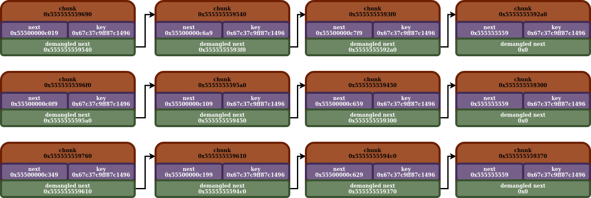

## tcache

- [back](readme.md)

So the tcache is a heap binning mechanism, designed to recycle previously freed chunks to be used later. It is the first binning mechanism which malloc will try to either pull chunks from to malloc, or insert newly freed chunks into.

Now one thing that separates the tcache from all of the other binning mechanisms. It operates on a per thread instance. That means, for each different thread your program has, it has a unique `tcache_pethread_struct` instance to model the tcache for that individual thread. In addition to that, it is the only binning mechanism not stored in the `main_arena` (that will be covered later).

Now about the tcache itself. The tcache consists of several different bins. Each bin is a singly linked list. The nodes in a singly linked list are previously freed malloc chunks, which can be recycled with future malloc calls. Each tcache bin is supposed to hold chunks of a particular size. This is the struct used to model a chunk present in a tcache bin, that is ready to be recycled with a future malloc call:

```
/* We overlay this structure on the user-data portion of a chunk when
   the chunk is stored in the per-thread cache.  */
typedef struct tcache_entry
{
  struct tcache_entry *next;
  /* This field exists to detect double frees.  */
  uintptr_t key;
} tcache_entry;
```

Now the various tcache bins are stored in a data structure known as a `tcache_perthread_struct`. This data structure is effectively just two separate arrays. The first array is a `uint16_t` array, where the values represent the number of chunks in a particular tcache bin. The second array, is an array of `tcache_entry` (tcache) chunks, which serve as the head on the singly linked list which is the tcache bin. If the bin has no chunks, the head ptr is `0x00`.

```
/* There is one of these for each thread, which contains the
   per-thread cache (hence "tcache_perthread_struct").  Keeping
   overall size low is mildly important.  Note that COUNTS and ENTRIES
   are redundant (we could have just counted the linked list each
   time), this is for performance reasons.  */
typedef struct tcache_perthread_struct
{
  uint16_t counts[TCACHE_MAX_BINS];
  tcache_entry *entries[TCACHE_MAX_BINS];
} tcache_perthread_struct;
```

The total size of a `tcache_perthread_struct` should be `640` bytes (or `80` qwords/8 byte words). This is because there are `64` `2` byte `uint16_t`s, and `8` byte ptrs.

We also see, that the max number of tcache bins is `64`:

```
# define TCACHE_MAX_BINS       64
```

#### Tcache Sizes / Indices

Another concept I'd like to introduce you to, is the idea of a tcache index. We see that the tcache bins are stored in an array. A tcache index is used to reference a particular tcache bin in the `tcache_entry *entries` array. Now what separates most tcache bins, is the size of the chunks that it's supposed to store. To get the particular tcache which corresponds to a particular size (either for allocation, or freeing) it can take the size, run it through an algorithm, and that will generate the index. Using that index, it can get either the head chunk, or count (number of tcache chunks in that bin) for that particular tcache bin.

Now, the mapping between tcache index and size is relatively simple. All tcache bins only hold a particular size. It starts off at `0x20`, then goes to `0x30/0x40/0x05...` up to index `63` with size `0x410`. Now the size range you will see is `0x10` bytes. However when malloc is allocating a chunk, it will round up to the nearest `0x10` divisible size. As such in practicality, each tcache bin only stores chunks of a particular size.

| Index | Size |
| ---- | ---- |
| 0 | 0x20 |
| 1 | 0x30 |
| 2 | 0x40 |
| 3 | 0x50 |
| 4 | 0x60 |
| 5 | 0x70 |
| 6 | 0x80 |
| 7 | 0x90 |
| 8 | 0xa0 |
| 9 | 0xb0 |
| 10 | 0xc0 |
| 11 | 0xd0 |
| 12 | 0xe0 |
| 13 | 0xf0 |
| 14 | 0x100 |
| 15 | 0x110 |
| 16 | 0x120 |
| 17 | 0x130 |
| 18 | 0x140 |
| 19 | 0x150 |
| 20 | 0x160 |
| 21 | 0x170 |
| 22 | 0x180 |
| 23 | 0x190 |
| 24 | 0x1a0 |
| 25 | 0x1b0 |
| 26 | 0x1c0 |
| 27 | 0x1d0 |
| 28 | 0x1e0 |
| 29 | 0x1f0 |
| 30 | 0x200 |
| 31 | 0x210 |
| 32 | 0x220 |
| 33 | 0x230 |
| 34 | 0x240 |
| 35 | 0x250 |
| 36 | 0x260 |
| 37 | 0x270 |
| 38 | 0x280 |
| 39 | 0x290 |
| 40 | 0x2a0 |
| 41 | 0x2b0 |
| 42 | 0x2c0 |
| 43 | 0x2d0 |
| 44 | 0x2e0 |
| 45 | 0x2f0 |
| 46 | 0x300 |
| 47 | 0x310 |
| 48 | 0x320 |
| 49 | 0x330 |
| 50 | 0x340 |
| 51 | 0x350 |
| 52 | 0x360 |
| 53 | 0x370 |
| 54 | 0x380 |
| 55 | 0x390 |
| 56 | 0x3a0 |
| 57 | 0x3b0 |
| 58 | 0x3c0 |
| 59 | 0x3d0 |
| 60 | 0x3e0 |
| 61 | 0x3f0 |
| 62 | 0x400 |
| 63 | 0x410 |

#### Tcache Insertions / Removals

So tcache insertions, and removals, both happen at the head of the linked list. Since the tcache only heeps a head ptr of the singly linked list, and the primary concern when allocating a chunk is the size of the chunk (which it already knows since each tcache only stores chunks of one size), it just needs any chunk from the tcache. So simply doing both insertions and removals at the head, helps with performance and keeps things simple (at least I assume that is the reasoning).

#### Tcache Key

Now a tcache chunk is supposed to hold 2 values. The first is the next ptr for the singly linked list which is the tcache. The second however is a `key` value. This value will be covered more in depth later. While not foolproof, its purpose is to help detect heap corruption bugs such as double frees. It places that value there to know that it is a chunk in the tcache. That way when a new chunk is being inserted into the tcache, it can check if it has the key value. If it does have the key value, then it knows there is a huge likelihood a double free bug is going on.

#### Ptr Mangling

The next thing I'd like to discuss is the concept of ptr mangling. This doesn't apply to the head ptr stored in the `tcache_perthread_struct`, rather the next ptrs stored in the actual tcache chunks in the tcache bins. So the next ptrs that are stored there, aren't exactly the actual ptr. Rather they are the ptr, xored by a value. That value is the location in memory of the next ptr, shifted to the right by `12` bits.

```
/* Safe-Linking:
   Use randomness from ASLR (mmap_base) to protect single-linked lists
   of Fast-Bins and TCache.  That is, mask the "next" pointers of the
   lists' chunks, and also perform allocation alignment checks on them.
   This mechanism reduces the risk of pointer hijacking, as was done with
   Safe-Unlinking in the double-linked lists of Small-Bins.
   It assumes a minimum page size of 4096 bytes (12 bits).  Systems with
   larger pages provide less entropy, although the pointer mangling
   still works.  */
#define PROTECT_PTR(pos, ptr) \
  ((__typeof (ptr)) ((((size_t) pos) >> 12) ^ ((size_t) ptr)))
#define REVEAL_PTR(ptr)  PROTECT_PTR (&ptr, ptr)
```

Here is some python3 code that does the same thing (to me, it's easier to read):

```
def mangle_ptr(next_ptr: int, ptr_loc: int) -> int:
    mangled_ptr = (next_ptr) ^ (ptr_loc >> 12)
    print(hex(mangled_ptr))
```

The process works the same to both mangle the ptr, and demangle the ptr. You just change out the `next_ptr` value for either the mangled / demangled ptr:

```
>>> mangle_ptr(0x55500000c019, 0x555555559690)
0x555555559540
>>> mangle_ptr(0x555555559540, 0x555555559690)
0x55500000c019
```

Let's actually see this in practice. Here we have three separate tcache bins, each with `4` chunk. We will be looking through the tcache bin with a `0x0000555555559690` head ptr.

```
gef➤  p tcache
$2 = (tcache_perthread_struct *) 0x555555559010
gef➤  x/80g tcache
0x555555559010:    0x0004000400040000    0x0000000000000000
0x555555559020:    0x0000000000000000    0x0000000000000000
0x555555559030:    0x0000000000000000    0x0000000000000000
0x555555559040:    0x0000000000000000    0x0000000000000000
0x555555559050:    0x0000000000000000    0x0000000000000000
0x555555559060:    0x0000000000000000    0x0000000000000000
0x555555559070:    0x0000000000000000    0x0000000000000000
0x555555559080:    0x0000000000000000    0x0000000000000000
0x555555559090:    0x0000000000000000    0x0000555555559690
0x5555555590a0:    0x00005555555596f0    0x0000555555559760
0x5555555590b0:    0x0000000000000000    0x0000000000000000
0x5555555590c0:    0x0000000000000000    0x0000000000000000
0x5555555590d0:    0x0000000000000000    0x0000000000000000
0x5555555590e0:    0x0000000000000000    0x0000000000000000
0x5555555590f0:    0x0000000000000000    0x0000000000000000
0x555555559100:    0x0000000000000000    0x0000000000000000
0x555555559110:    0x0000000000000000    0x0000000000000000
0x555555559120:    0x0000000000000000    0x0000000000000000
0x555555559130:    0x0000000000000000    0x0000000000000000
0x555555559140:    0x0000000000000000    0x0000000000000000
0x555555559150:    0x0000000000000000    0x0000000000000000
0x555555559160:    0x0000000000000000    0x0000000000000000
0x555555559170:    0x0000000000000000    0x0000000000000000
0x555555559180:    0x0000000000000000    0x0000000000000000
0x555555559190:    0x0000000000000000    0x0000000000000000
0x5555555591a0:    0x0000000000000000    0x0000000000000000
0x5555555591b0:    0x0000000000000000    0x0000000000000000
0x5555555591c0:    0x0000000000000000    0x0000000000000000
0x5555555591d0:    0x0000000000000000    0x0000000000000000
0x5555555591e0:    0x0000000000000000    0x0000000000000000
0x5555555591f0:    0x0000000000000000    0x0000000000000000
0x555555559200:    0x0000000000000000    0x0000000000000000
0x555555559210:    0x0000000000000000    0x0000000000000000
0x555555559220:    0x0000000000000000    0x0000000000000000
0x555555559230:    0x0000000000000000    0x0000000000000000
0x555555559240:    0x0000000000000000    0x0000000000000000
0x555555559250:    0x0000000000000000    0x0000000000000000
0x555555559260:    0x0000000000000000    0x0000000000000000
0x555555559270:    0x0000000000000000    0x0000000000000000
0x555555559280:    0x0000000000000000    0x0000000000000000
gef➤  x/10g 0x0000555555559690
0x555555559690:    0x000055500000c019    0x26288cb33a7af3a0
0x5555555596a0:    0x0000000000000000    0x0000000000000000
0x5555555596b0:    0x0000000000000000    0x0000000000000031
0x5555555596c0:    0x0000000000000000    0x0000000000000000
0x5555555596d0:    0x0000000000000000    0x0000000000000000
gef➤  x/10g 0x555555559540
0x555555559540:    0x000055500000c6a9    0x26288cb33a7af3a0
0x555555559550:    0x0000000000000000    0x0000000000000000
0x555555559560:    0x0000000000000000    0x0000000000000031
0x555555559570:    0x0000000000000000    0x0000000000000000
0x555555559580:    0x0000000000000000    0x0000000000000000
gef➤  x/10g 0x5555555593f0
0x5555555593f0:    0x000055500000c7f9    0x26288cb33a7af3a0
0x555555559400:    0x0000000000000000    0x0000000000000000
0x555555559410:    0x0000000000000000    0x0000000000000031
0x555555559420:    0x0000000000000000    0x0000000000000000
0x555555559430:    0x0000000000000000    0x0000000000000000
gef➤  x/10g 0x5555555592a0
0x5555555592a0:    0x0000000555555559    0x26288cb33a7af3a0
0x5555555592b0:    0x0000000000000000    0x0000000000000000
0x5555555592c0:    0x0000000000000000    0x0000000000000031
0x5555555592d0:    0x0000000000000000    0x0000000000000000
0x5555555592e0:    0x0000000000000000    0x0000000000000000
```

With this being the ptr demangling:

```
>>> mangle_ptr(0x000055500000c019, 0x555555559690)
0x555555559540
>>> mangle_ptr(0x000055500000c6a9, 0x555555559540)
0x5555555593f0
>>> mangle_ptr(0x000055500000c7f9, 0x5555555593f0)
0x5555555592a0
>>> mangle_ptr(0x0000000555555559, 0x5555555592a0)
0x0
```

#### Tcache Bin Max Size

So each tcache does have a max limit set on how many chunks that can be stored in it at any point in time. This limit is `7`.

```
/* This is another arbitrary limit, which tunables can change.  Each
   tcache bin will hold at most this number of chunks.  */
# define TCACHE_FILL_COUNT 7
```

#### Tcache Diagram

Here is a diagram depicting an example tcache:



With this being the actual in memory layout of the tcache, which this diagram models:

```
gef➤  x/80g tcache
0x555555559010:   0x4000400040000   0x0
0x555555559020:   0x0   0x0
0x555555559030:   0x0   0x0
0x555555559040:   0x0   0x0
0x555555559050:   0x0   0x0
0x555555559060:   0x0   0x0
0x555555559070:   0x0   0x0
0x555555559080:   0x0   0x0
0x555555559090:   0x0   0x555555559690
0x5555555590a0:   0x5555555596f0 0x555555559760
0x5555555590b0:   0x0   0x0
0x5555555590c0:   0x0   0x0
0x5555555590d0:   0x0   0x0
0x5555555590e0:   0x0   0x0
0x5555555590f0:   0x0   0x0
0x555555559100:   0x0   0x0
0x555555559110:   0x0   0x0
0x555555559120:   0x0   0x0
0x555555559130:   0x0   0x0
0x555555559140:   0x0   0x0
0x555555559150:   0x0   0x0
0x555555559160:   0x0   0x0
0x555555559170:   0x0   0x0
0x555555559180:   0x0   0x0
0x555555559190:   0x0   0x0
0x5555555591a0:   0x0   0x0
0x5555555591b0:   0x0   0x0
0x5555555591c0:   0x0   0x0
0x5555555591d0:   0x0   0x0
0x5555555591e0:   0x0   0x0
0x5555555591f0:   0x0   0x0
0x555555559200:   0x0   0x0
0x555555559210:   0x0   0x0
0x555555559220:   0x0   0x0
0x555555559230:   0x0   0x0
0x555555559240:   0x0   0x0
0x555555559250:   0x0   0x0
0x555555559260:   0x0   0x0
0x555555559270:   0x0   0x0
0x555555559280:   0x0   0x0
gef➤  x/10g 0x555555559690
0x555555559690:   0x55500000c019 0x67c37c9ff87c1496
0x5555555596a0:   0x0   0x0
0x5555555596b0:   0x0   0x31
0x5555555596c0:   0x0   0x0
0x5555555596d0:   0x0   0x0
gef➤  x/10g 0x555555559540
0x555555559540:   0x55500000c6a9 0x67c37c9ff87c1496
0x555555559550:   0x0   0x0
0x555555559560:   0x0   0x31
0x555555559570:   0x0   0x0
0x555555559580:   0x0   0x0
gef➤  x/10g 0x5555555593f0
0x5555555593f0:   0x55500000c7f9 0x67c37c9ff87c1496
0x555555559400:   0x0   0x0
0x555555559410:   0x0   0x31
0x555555559420:   0x0   0x0
0x555555559430:   0x0   0x0
gef➤  x/10g 0x5555555592a0
0x5555555592a0:   0x555555559 0x67c37c9ff87c1496
0x5555555592b0:   0x0   0x0
0x5555555592c0:   0x0   0x31
0x5555555592d0:   0x0   0x0
0x5555555592e0:   0x0   0x0
gef➤  x/10g 0x5555555596f0
0x5555555596f0:   0x55500000c0f9 0x67c37c9ff87c1496
0x555555559700:   0x0   0x0
0x555555559710:   0x0   0x0
0x555555559720:   0x0   0x31
0x555555559730:   0x0   0x0
gef➤  x/10g 0x5555555595a0
0x5555555595a0:   0x55500000c109 0x67c37c9ff87c1496
0x5555555595b0:   0x0   0x0
0x5555555595c0:   0x0   0x0
0x5555555595d0:   0x0   0x31
0x5555555595e0:   0x0   0x0
gef➤  x/10g 0x555555559450
0x555555559450:   0x55500000c659 0x67c37c9ff87c1496
0x555555559460:   0x0   0x0
0x555555559470:   0x0   0x0
0x555555559480:   0x0   0x31
0x555555559490:   0x0   0x0
gef➤  x/10g 0x555555559300
0x555555559300:   0x555555559 0x67c37c9ff87c1496
0x555555559310:   0x0   0x0
0x555555559320:   0x0   0x0
0x555555559330:   0x0   0x31
0x555555559340:   0x0   0x0
gef➤  x/10g 0x555555559760
0x555555559760:   0x55500000c349 0x67c37c9ff87c1496
0x555555559770:   0x0   0x0
0x555555559780:   0x0   0x0
0x555555559790:   0x0   0x0
0x5555555597a0:   0x0   0x31
gef➤  x/10g 0x555555559610
0x555555559610:   0x55500000c199 0x67c37c9ff87c1496
0x555555559620:   0x0   0x0
0x555555559630:   0x0   0x0
0x555555559640:   0x0   0x0
0x555555559650:   0x0   0x31
gef➤  x/10g 0x5555555594c0
0x5555555594c0:   0x55500000c629 0x67c37c9ff87c1496
0x5555555594d0:   0x0   0x0
0x5555555594e0:   0x0   0x0
0x5555555594f0:   0x0   0x0
0x555555559500:   0x0   0x31
gef➤  x/10g 0x555555559370
0x555555559370:   0x555555559 0x67c37c9ff87c1496
0x555555559380:   0x0   0x0
0x555555559390:   0x0   0x0
0x5555555593a0:   0x0   0x0
0x5555555593b0:   0x0   0x31
```

And here is the ptr demangling for that:
```
>>> mangle_ptr(0x55500000c019, 0x555555559690)
0x555555559540
>>> mangle_ptr(0x55500000c6a9, 0x555555559540)
0x5555555593f0
>>> mangle_ptr(0x55500000c7f9, 0x5555555593f0)
0x5555555592a0
>>> mangle_ptr(0x555555559, 0x5555555592a0)
0x0
>>> mangle_ptr(0x55500000c0f9, 0x5555555596f0)
0x5555555595a0
>>> mangle_ptr(0x55500000c109, 0x5555555595a0)
0x555555559450
>>> mangle_ptr(0x55500000c659, 0x555555559450)
0x555555559300
>>> mangle_ptr(0x555555559, 0x555555559300)
0x0
>>> mangle_ptr(0x55500000c349, 0x555555559760)
0x555555559610
>>> mangle_ptr(0x55500000c199, 0x555555559610)
0x5555555594c0
>>> mangle_ptr(0x55500000c629, 0x5555555594c0)
0x555555559370
>>> mangle_ptr(0x555555559, 0x555555559370)
0x0
```

#### Tcache Insertion Demo

So in this demo, we will see an example of a new chunk entering into an existing tcache with chunks in it. Currently the tcache has `2` chunks in it, with it being `0x5555555592f0` as the old head, and `0x5555555592a0` after that in the singly linked list. The new chunk being inserted is `0x555555559340`. Since insertions and removals both happen at the head, `0x555555559340` will become the new head. The rest of the ordering of the list will stay the same, so it will be `0x5555555592f0` after that chunk, and `0x5555555592a0` as the end of the list. Also we see after the insertion, the tcache count in the `tcache_perthread_struct` is updated from `2` to `3`.

Before:

```
gef➤  x/80g tcache
0x555555559010:   0x2   0x0
0x555555559020:   0x0   0x0
0x555555559030:   0x0   0x0
0x555555559040:   0x0   0x0
0x555555559050:   0x0   0x0
0x555555559060:   0x0   0x0
0x555555559070:   0x0   0x0
0x555555559080:   0x0   0x0
0x555555559090:   0x5555555592f0 0x0
0x5555555590a0:   0x0   0x0
0x5555555590b0:   0x0   0x0
0x5555555590c0:   0x0   0x0
0x5555555590d0:   0x0   0x0
0x5555555590e0:   0x0   0x0
0x5555555590f0:   0x0   0x0
0x555555559100:   0x0   0x0
0x555555559110:   0x0   0x0
0x555555559120:   0x0   0x0
0x555555559130:   0x0   0x0
0x555555559140:   0x0   0x0
0x555555559150:   0x0   0x0
0x555555559160:   0x0   0x0
0x555555559170:   0x0   0x0
0x555555559180:   0x0   0x0
0x555555559190:   0x0   0x0
0x5555555591a0:   0x0   0x0
0x5555555591b0:   0x0   0x0
0x5555555591c0:   0x0   0x0
0x5555555591d0:   0x0   0x0
0x5555555591e0:   0x0   0x0
0x5555555591f0:   0x0   0x0
0x555555559200:   0x0   0x0
0x555555559210:   0x0   0x0
0x555555559220:   0x0   0x0
0x555555559230:   0x0   0x0
0x555555559240:   0x0   0x0
0x555555559250:   0x0   0x0
0x555555559260:   0x0   0x0
0x555555559270:   0x0   0x0
0x555555559280:   0x0   0x0
gef➤  x/10g 0x5555555592f0
0x5555555592f0:   0x55500000c7f9 0x88bc9cfac3616f47
0x555555559300:   0x0   0x31
0x555555559310:   0x0   0x0
0x555555559320:   0x0   0x0
0x555555559330:   0x0   0x21
gef➤  x/10g 0x5555555592a0
0x5555555592a0:   0x555555559 0x88bc9cfac3616f47
0x5555555592b0:   0x0   0x31
0x5555555592c0:   0x0   0x0
0x5555555592d0:   0x0   0x0
0x5555555592e0:   0x0   0x21
```

After:

```
gef➤  x/80g tcache
0x555555559010:   0x3   0x0
0x555555559020:   0x0   0x0
0x555555559030:   0x0   0x0
0x555555559040:   0x0   0x0
0x555555559050:   0x0   0x0
0x555555559060:   0x0   0x0
0x555555559070:   0x0   0x0
0x555555559080:   0x0   0x0
0x555555559090:   0x555555559340 0x0
0x5555555590a0:   0x0   0x0
0x5555555590b0:   0x0   0x0
0x5555555590c0:   0x0   0x0
0x5555555590d0:   0x0   0x0
0x5555555590e0:   0x0   0x0
0x5555555590f0:   0x0   0x0
0x555555559100:   0x0   0x0
0x555555559110:   0x0   0x0
0x555555559120:   0x0   0x0
0x555555559130:   0x0   0x0
0x555555559140:   0x0   0x0
0x555555559150:   0x0   0x0
0x555555559160:   0x0   0x0
0x555555559170:   0x0   0x0
0x555555559180:   0x0   0x0
0x555555559190:   0x0   0x0
0x5555555591a0:   0x0   0x0
0x5555555591b0:   0x0   0x0
0x5555555591c0:   0x0   0x0
0x5555555591d0:   0x0   0x0
0x5555555591e0:   0x0   0x0
0x5555555591f0:   0x0   0x0
0x555555559200:   0x0   0x0
0x555555559210:   0x0   0x0
0x555555559220:   0x0   0x0
0x555555559230:   0x0   0x0
0x555555559240:   0x0   0x0
0x555555559250:   0x0   0x0
0x555555559260:   0x0   0x0
0x555555559270:   0x0   0x0
0x555555559280:   0x0   0x0
gef➤  x/10g 0x555555559340
0x555555559340:   0x55500000c7a9 0x88bc9cfac3616f47
0x555555559350:   0x0   0x31
0x555555559360:   0x0   0x0
0x555555559370:   0x0   0x0
0x555555559380:   0x0   0x21
gef➤  x/10g 0x5555555592f0
0x5555555592f0:   0x55500000c7f9 0x88bc9cfac3616f47
0x555555559300:   0x0   0x31
0x555555559310:   0x0   0x0
0x555555559320:   0x0   0x0
0x555555559330:   0x0   0x21
gef➤  x/10g 0x5555555592a0
0x5555555592a0:   0x555555559 0x88bc9cfac3616f47
0x5555555592b0:   0x0   0x31
0x5555555592c0:   0x0   0x0
0x5555555592d0:   0x0   0x0
0x5555555592e0:   0x0   0x21
```

Ptr demangling:

```
>>> mangle_ptr(0x55500000c7f9, 0x5555555592f0)
0x5555555592a0
>>> mangle_ptr(0x55500000c7a9, 0x555555559340)
0x5555555592f0
>>> mangle_ptr(0x555555559, 0x5555555592a0)
0x0
```

#### Tcache Removal Demo

So here, we are going to cover an example of what a chunk removal from a tcache bin looks like. Right now, the tcache bin we will remove a chunk from has `2` chunks in it. The head is the `0x5555555592f0` chunk, and the chunk after it is `0x5555555592a0`. Since both insertions and removals happen at the head, this means that `0x5555555592f0` will be removed from the list, and the chunk after it (`0x5555555592a0`) will become the new head. In addition to that, the count in the `tcache_perthread_struct` will be decremented from `2` to `1`.

Before:

```
gef➤  x/80g tcache
0x555555559010:   0x2   0x0
0x555555559020:   0x0   0x0
0x555555559030:   0x0   0x0
0x555555559040:   0x0   0x0
0x555555559050:   0x0   0x0
0x555555559060:   0x0   0x0
0x555555559070:   0x0   0x0
0x555555559080:   0x0   0x0
0x555555559090:   0x5555555592f0 0x0
0x5555555590a0:   0x0   0x0
0x5555555590b0:   0x0   0x0
0x5555555590c0:   0x0   0x0
0x5555555590d0:   0x0   0x0
0x5555555590e0:   0x0   0x0
0x5555555590f0:   0x0   0x0
0x555555559100:   0x0   0x0
0x555555559110:   0x0   0x0
0x555555559120:   0x0   0x0
0x555555559130:   0x0   0x0
0x555555559140:   0x0   0x0
0x555555559150:   0x0   0x0
0x555555559160:   0x0   0x0
0x555555559170:   0x0   0x0
0x555555559180:   0x0   0x0
0x555555559190:   0x0   0x0
0x5555555591a0:   0x0   0x0
0x5555555591b0:   0x0   0x0
0x5555555591c0:   0x0   0x0
0x5555555591d0:   0x0   0x0
0x5555555591e0:   0x0   0x0
0x5555555591f0:   0x0   0x0
0x555555559200:   0x0   0x0
0x555555559210:   0x0   0x0
0x555555559220:   0x0   0x0
0x555555559230:   0x0   0x0
0x555555559240:   0x0   0x0
0x555555559250:   0x0   0x0
0x555555559260:   0x0   0x0
0x555555559270:   0x0   0x0
0x555555559280:   0x0   0x0
gef➤  x/10g 0x5555555592f0
0x5555555592f0:   0x55500000c7f9 0x4a15f7812ef9bffc
0x555555559300:   0x0   0x31
0x555555559310:   0x0   0x0
0x555555559320:   0x0   0x0
0x555555559330:   0x0   0x411
gef➤  x/10g 0x5555555592a0
0x5555555592a0:   0x555555559 0x4a15f7812ef9bffc
0x5555555592b0:   0x0   0x31
0x5555555592c0:   0x0   0x0
0x5555555592d0:   0x0   0x0
0x5555555592e0:   0x0   0x21
```

After:

```
gef➤  x/80g tcache
0x555555559010:   0x1   0x0
0x555555559020:   0x0   0x0
0x555555559030:   0x0   0x0
0x555555559040:   0x0   0x0
0x555555559050:   0x0   0x0
0x555555559060:   0x0   0x0
0x555555559070:   0x0   0x0
0x555555559080:   0x0   0x0
0x555555559090:   0x5555555592a0 0x0
0x5555555590a0:   0x0   0x0
0x5555555590b0:   0x0   0x0
0x5555555590c0:   0x0   0x0
0x5555555590d0:   0x0   0x0
0x5555555590e0:   0x0   0x0
0x5555555590f0:   0x0   0x0
0x555555559100:   0x0   0x0
0x555555559110:   0x0   0x0
0x555555559120:   0x0   0x0
0x555555559130:   0x0   0x0
0x555555559140:   0x0   0x0
0x555555559150:   0x0   0x0
0x555555559160:   0x0   0x0
0x555555559170:   0x0   0x0
0x555555559180:   0x0   0x0
0x555555559190:   0x0   0x0
0x5555555591a0:   0x0   0x0
0x5555555591b0:   0x0   0x0
0x5555555591c0:   0x0   0x0
0x5555555591d0:   0x0   0x0
0x5555555591e0:   0x0   0x0
0x5555555591f0:   0x0   0x0
0x555555559200:   0x0   0x0
0x555555559210:   0x0   0x0
0x555555559220:   0x0   0x0
0x555555559230:   0x0   0x0
0x555555559240:   0x0   0x0
0x555555559250:   0x0   0x0
0x555555559260:   0x0   0x0
0x555555559270:   0x0   0x0
0x555555559280:   0x0   0x0
gef➤  x/10g 0x5555555592a0
0x5555555592a0:   0x555555559 0x4a15f7812ef9bffc
0x5555555592b0:   0x0   0x31
0x5555555592c0:   0x0   0x0
0x5555555592d0:   0x0   0x0
0x5555555592e0:   0x0   0x21
```

Ptr Demangling:

```
>>> mangle_ptr(0x55500000c7f9, 0x5555555592f0)
0x5555555592a0
>>> mangle_ptr(0x555555559, 0x5555555592a0)
0x0
```
