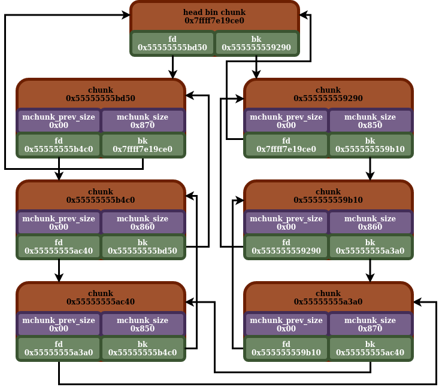

## Unsorted Bin

- [back](readme.md)

This shares some of the attributes listed in [bins](bins.md).

So the unsorted is a single bin, stored at index `1` in the main arena bin array. Being a typical main arena bin, it is a doubly linked circular linked list.

So, like I mentioned before, all of the bins will have a "head bin ptr" chunk. When the unsorted bin is empty, both the `fd/bk` (head/tail) pointer will point to itself (`0x10` bytes before the location of the `fd/bk` ptrs, because of the reasons described before).

So what is the purpose of the unsorted bin. It is another mechanism to recycle freed malloc chunks. It differs from other mechanisms, in a few ways. First off, in this libc version, in order for a chunk to be inserted into the unsorted bin, it has to first not be able to be inserted into the tcache and fastbins (either for size reasons, or that they are full). If they can't be inserted into those other binning structures, and malloc determines that it wants to actually recycle this chunk with a bin, it will be inserted into the unsorted bin. Freed chunks that do not end up in the tcache / fastbin do not always end up in the inserted bin, since malloc doesn't want to recycle them (such as in instances where the chunk to be freed is adjacent to the top chunk, it can just consolidate it into the top chunk).

So, the unsorted bin serves as the first spot where freed chunks that are to be inserted into the heap bins to be recycled end up (assuming they aren't first placed in either the tcache or the fastbin). The unsorted bin can hold chunks of a ton of different sizes, and doesn't store them in any sorted order (hence the name). When malloc is called, assuming it isn't able to allocate a chunk from one of the other mechanisms first (this will be covered in more detail later), and the unsorted bin isn't empty, it will iterate through the chunks in the unsorted bin. If it finds a chunk in the unsorted bin that is an exact match, that will get allocated. If not, it will usually place the chunks in either the appropriate matching small, or large bin.

So, with the unsorted bin's "bin head chunk", it has a `fd`, and a `bk` pointer. Insertions are made at the `fd` end (head), and removals are executed at the `bk` end (tail).

Here is a diagram on an unsorted bin:



And here is the actual in memory unsorted bin of the diagram:

```
gef➤  x/10g 0x7ffff7e19ce0
0x7ffff7e19ce0 <main_arena+96>: 0x55555555c5f0  0x0
0x7ffff7e19cf0 <main_arena+112>:  0x55555555bd50  0x555555559290
0x7ffff7e19d00 <main_arena+128>:  0x7ffff7e19cf0  0x7ffff7e19cf0
0x7ffff7e19d10 <main_arena+144>:  0x7ffff7e19d00  0x7ffff7e19d00
0x7ffff7e19d20 <main_arena+160>:  0x7ffff7e19d10  0x7ffff7e19d10
gef➤  x/10g 0x55555555bd50
0x55555555bd50: 0x0 0x871
0x55555555bd60: 0x55555555b4c0  0x7ffff7e19ce0
0x55555555bd70: 0x0 0x0
0x55555555bd80: 0x0 0x0
0x55555555bd90: 0x0 0x0
gef➤  x/10g 0x55555555b4c0
0x55555555b4c0: 0x0 0x861
0x55555555b4d0: 0x55555555ac40  0x55555555bd50
0x55555555b4e0: 0x0 0x0
0x55555555b4f0: 0x0 0x0
0x55555555b500: 0x0 0x0
gef➤  x/10g 0x55555555ac40
0x55555555ac40: 0x0 0x851
0x55555555ac50: 0x55555555a3a0  0x55555555b4c0
0x55555555ac60: 0x0 0x0
0x55555555ac70: 0x0 0x0
0x55555555ac80: 0x0 0x0
gef➤  x/10g 0x55555555a3a0
0x55555555a3a0: 0x0 0x871
0x55555555a3b0: 0x555555559b10  0x55555555ac40
0x55555555a3c0: 0x0 0x0
0x55555555a3d0: 0x0 0x0
0x55555555a3e0: 0x0 0x0
gef➤  x/10g 0x555555559b10
0x555555559b10: 0x0 0x861
0x555555559b20: 0x555555559290  0x55555555a3a0
0x555555559b30: 0x0 0x0
0x555555559b40: 0x0 0x0
0x555555559b50: 0x0 0x0
gef➤  x/10g 0x555555559290
0x555555559290: 0x0 0x851
0x5555555592a0: 0x7ffff7e19ce0  0x555555559b10
0x5555555592b0: 0x0 0x0
0x5555555592c0: 0x0 0x0
0x5555555592d0: 0x0 0x0
gef➤  x/10g 0x7ffff7e19ce0
0x7ffff7e19ce0 <main_arena+96>: 0x55555555c5f0  0x0
0x7ffff7e19cf0 <main_arena+112>:  0x55555555bd50  0x555555559290
0x7ffff7e19d00 <main_arena+128>:  0x7ffff7e19cf0  0x7ffff7e19cf0
0x7ffff7e19d10 <main_arena+144>:  0x7ffff7e19d00  0x7ffff7e19d00
0x7ffff7e19d20 <main_arena+160>:  0x7ffff7e19d10  0x7ffff7e19d10
```

## Unsorted Bin Insertion

So here, we are seeing an example of a new chunk being inserted into the unsorted bin. Insertions are made at the `fd` side (the head) of the "head bin ptr". Insertions are done when a `free` call is made, and when it determines that the chunk needs to go into the unsorted bin (exact criteria for that will be covered later). So, it just updates the chunk that is the head (new head chunk is `0x55555555b4c0` in this example), and links it to the rest of the circular doubly linked list, which we see here:

Before:
```
gef➤  x/10g 0x7ffff7e19ce0
0x7ffff7e19ce0 <main_arena+96>: 0x55555555c5f0  0x0
0x7ffff7e19cf0 <main_arena+112>:  0x55555555ac40  0x555555559290
0x7ffff7e19d00 <main_arena+128>:  0x7ffff7e19cf0  0x7ffff7e19cf0
0x7ffff7e19d10 <main_arena+144>:  0x7ffff7e19d00  0x7ffff7e19d00
0x7ffff7e19d20 <main_arena+160>:  0x7ffff7e19d10  0x7ffff7e19d10
gef➤  x/10g 0x55555555ac40
0x55555555ac40: 0x0 0x851
0x55555555ac50: 0x55555555a3a0  0x7ffff7e19ce0
0x55555555ac60: 0x0 0x0
0x55555555ac70: 0x0 0x0
0x55555555ac80: 0x0 0x0
gef➤  x/10g 0x55555555a3a0
0x55555555a3a0: 0x0 0x871
0x55555555a3b0: 0x555555559b10  0x55555555ac40
0x55555555a3c0: 0x0 0x0
0x55555555a3d0: 0x0 0x0
0x55555555a3e0: 0x0 0x0
gef➤  x/10g 0x555555559b10
0x555555559b10: 0x0 0x861
0x555555559b20: 0x555555559290  0x55555555a3a0
0x555555559b30: 0x0 0x0
0x555555559b40: 0x0 0x0
0x555555559b50: 0x0 0x0
gef➤  x/10g 0x555555559290
0x555555559290: 0x0 0x851
0x5555555592a0: 0x7ffff7e19ce0  0x555555559b10
0x5555555592b0: 0x0 0x0
0x5555555592c0: 0x0 0x0
0x5555555592d0: 0x0 0x0
gef➤  x/10g 0x7ffff7e19ce0
0x7ffff7e19ce0 <main_arena+96>: 0x55555555c5f0  0x0
0x7ffff7e19cf0 <main_arena+112>:  0x55555555ac40  0x555555559290
0x7ffff7e19d00 <main_arena+128>:  0x7ffff7e19cf0  0x7ffff7e19cf0
0x7ffff7e19d10 <main_arena+144>:  0x7ffff7e19d00  0x7ffff7e19d00
0x7ffff7e19d20 <main_arena+160>:  0x7ffff7e19d10  0x7ffff7e19d10
```

After:
```
gef➤  x/10g 0x7ffff7e19ce0
0x7ffff7e19ce0 <main_arena+96>: 0x55555555c5f0  0x0
0x7ffff7e19cf0 <main_arena+112>:  0x55555555b4c0  0x555555559290
0x7ffff7e19d00 <main_arena+128>:  0x7ffff7e19cf0  0x7ffff7e19cf0
0x7ffff7e19d10 <main_arena+144>:  0x7ffff7e19d00  0x7ffff7e19d00
0x7ffff7e19d20 <main_arena+160>:  0x7ffff7e19d10  0x7ffff7e19d10
gef➤  x/10g 0x55555555b4c0
0x55555555b4c0: 0x0 0x861
0x55555555b4d0: 0x55555555ac40  0x7ffff7e19ce0
0x55555555b4e0: 0x0 0x0
0x55555555b4f0: 0x0 0x0
0x55555555b500: 0x0 0x0
gef➤  x/10g 0x55555555ac40
0x55555555ac40: 0x0 0x851
0x55555555ac50: 0x55555555a3a0  0x55555555b4c0
0x55555555ac60: 0x0 0x0
0x55555555ac70: 0x0 0x0
0x55555555ac80: 0x0 0x0
gef➤  x/10g 0x55555555a3a0
0x55555555a3a0: 0x0 0x871
0x55555555a3b0: 0x555555559b10  0x55555555ac40
0x55555555a3c0: 0x0 0x0
0x55555555a3d0: 0x0 0x0
0x55555555a3e0: 0x0 0x0
gef➤  x/10g 0x555555559b10
0x555555559b10: 0x0 0x861
0x555555559b20: 0x555555559290  0x55555555a3a0
0x555555559b30: 0x0 0x0
0x555555559b40: 0x0 0x0
0x555555559b50: 0x0 0x0
gef➤  x/10g 0x555555559290
0x555555559290: 0x0 0x851
0x5555555592a0: 0x7ffff7e19ce0  0x555555559b10
0x5555555592b0: 0x0 0x0
0x5555555592c0: 0x0 0x0
0x5555555592d0: 0x0 0x0
gef➤  x/10g 0x7ffff7e19ce0
0x7ffff7e19ce0 <main_arena+96>: 0x55555555c5f0  0x0
0x7ffff7e19cf0 <main_arena+112>:  0x55555555b4c0  0x555555559290
0x7ffff7e19d00 <main_arena+128>:  0x7ffff7e19cf0  0x7ffff7e19cf0
0x7ffff7e19d10 <main_arena+144>:  0x7ffff7e19d00  0x7ffff7e19d00
0x7ffff7e19d20 <main_arena+160>:  0x7ffff7e19d10  0x7ffff7e19d10

```

## Unsorted Bin Removal 0

So we will now briefly cover how a chunk is removed from the unsorted bin. Removals happen from the linked list when malloc is called, and it determines it wants to try looking through the unsorted bin. Chunks are removed from the tail of the circular doubly linked list, or rather the `bk` end of "bin head chunk". Chunks get removed from the unsorted bin, when malloc is called (assuming that it gets to the point where it checks for chunks in the unsorted bin, tcache and fastbin allocations come first). When it happens, it will iterate through the chunks of the unsorted bin, one by one. If it finds a chunk that is an exact size fit for what it needs, it will allocate that one. If it isn't an exact size fit, it will move the chunk over the small or large bins, and move onto the next chunk (assuming one of the other chunk allocation conditions are not met, will be covered later). After it finds a chunk to allocate, it will cease iterating through the unsorted bin.

In this instance, we are looking to allocate a chunk size of `0x850`, which is the chunk size of the last chunk in the unsorted bin. So in this instance (since the fastbin / tcache don't have any chunks we can use for this), it will just allocate the last chunk of the unsorted bin, and adjust the ptrs to reflect it:

Before:
```
gef➤  x/10g 0x7ffff7e19ce0
0x7ffff7e19ce0 <main_arena+96>: 0x55555555c5f0  0x0
0x7ffff7e19cf0 <main_arena+112>:  0x55555555bd50  0x555555559290
0x7ffff7e19d00 <main_arena+128>:  0x7ffff7e19cf0  0x7ffff7e19cf0
0x7ffff7e19d10 <main_arena+144>:  0x7ffff7e19d00  0x7ffff7e19d00
0x7ffff7e19d20 <main_arena+160>:  0x7ffff7e19d10  0x7ffff7e19d10
gef➤  x/10g 0x55555555bd50
0x55555555bd50: 0x0 0x871
0x55555555bd60: 0x55555555b4c0  0x7ffff7e19ce0
0x55555555bd70: 0x0 0x0
0x55555555bd80: 0x0 0x0
0x55555555bd90: 0x0 0x0
gef➤  x/10g 0x55555555b4c0
0x55555555b4c0: 0x0 0x861
0x55555555b4d0: 0x55555555ac40  0x55555555bd50
0x55555555b4e0: 0x0 0x0
0x55555555b4f0: 0x0 0x0
0x55555555b500: 0x0 0x0
gef➤  x/10g 0x55555555ac40
0x55555555ac40: 0x0 0x851
0x55555555ac50: 0x55555555a3a0  0x55555555b4c0
0x55555555ac60: 0x0 0x0
0x55555555ac70: 0x0 0x0
0x55555555ac80: 0x0 0x0
gef➤  x/10g 0x55555555a3a0
0x55555555a3a0: 0x0 0x871
0x55555555a3b0: 0x555555559b10  0x55555555ac40
0x55555555a3c0: 0x0 0x0
0x55555555a3d0: 0x0 0x0
0x55555555a3e0: 0x0 0x0
gef➤  x/10g 0x555555559b10
0x555555559b10: 0x0 0x861
0x555555559b20: 0x555555559290  0x55555555a3a0
0x555555559b30: 0x0 0x0
0x555555559b40: 0x0 0x0
0x555555559b50: 0x0 0x0
gef➤  x/10g 0x555555559290
0x555555559290: 0x0 0x851
0x5555555592a0: 0x7ffff7e19ce0  0x555555559b10
0x5555555592b0: 0x0 0x0
0x5555555592c0: 0x0 0x0
0x5555555592d0: 0x0 0x0
```

After:
```
gef➤  x/10g 0x7ffff7e19ce0
0x7ffff7e19ce0 <main_arena+96>: 0x55555555c5f0  0x0
0x7ffff7e19cf0 <main_arena+112>:  0x55555555bd50  0x555555559b10
0x7ffff7e19d00 <main_arena+128>:  0x7ffff7e19cf0  0x7ffff7e19cf0
0x7ffff7e19d10 <main_arena+144>:  0x7ffff7e19d00  0x7ffff7e19d00
0x7ffff7e19d20 <main_arena+160>:  0x7ffff7e19d10  0x7ffff7e19d10
gef➤  x/10g 0x55555555bd50
0x55555555bd50: 0x0 0x871
0x55555555bd60: 0x55555555b4c0  0x7ffff7e19ce0
0x55555555bd70: 0x0 0x0
0x55555555bd80: 0x0 0x0
0x55555555bd90: 0x0 0x0
gef➤  x/10g 0x55555555b4c0
0x55555555b4c0: 0x0 0x861
0x55555555b4d0: 0x55555555ac40  0x55555555bd50
0x55555555b4e0: 0x0 0x0
0x55555555b4f0: 0x0 0x0
0x55555555b500: 0x0 0x0
gef➤  x/10g 0x55555555ac40
0x55555555ac40: 0x0 0x851
0x55555555ac50: 0x55555555a3a0  0x55555555b4c0
0x55555555ac60: 0x0 0x0
0x55555555ac70: 0x0 0x0
0x55555555ac80: 0x0 0x0
gef➤  x/10g 0x55555555a3a0
0x55555555a3a0: 0x0 0x871
0x55555555a3b0: 0x555555559b10  0x55555555ac40
0x55555555a3c0: 0x0 0x0
0x55555555a3d0: 0x0 0x0
0x55555555a3e0: 0x0 0x0
gef➤  x/10g 0x555555559b10
0x555555559b10: 0x0 0x861
0x555555559b20: 0x7ffff7e19ce0  0x55555555a3a0
0x555555559b30: 0x0 0x0
0x555555559b40: 0x0 0x0
0x555555559b50: 0x0 0x0
```

## Unsorted Bin Removal 1

So in this instance, the unsorted bin is set up similar to the previous example. However we are looking to allocate a chunk size of `0x871`. As such, it will need to iterate through the chunks `0x555555559290` (size `0x850`), `0x555555559b10` (size `0x860`), and `0x55555555a3a0` (size `0x870`, which this chunk will actually be allocated). As such, only the first three chunks (`0x55555555bd50/0x55555555b4c0/0x55555555ac40`) will remain in the unsorted bin after this allocation:

Before:
```
gef➤  x/10g 0x7ffff7e19ce0
0x7ffff7e19ce0 <main_arena+96>: 0x55555555c5f0  0x0
0x7ffff7e19cf0 <main_arena+112>:  0x55555555bd50  0x555555559290
0x7ffff7e19d00 <main_arena+128>:  0x7ffff7e19cf0  0x7ffff7e19cf0
0x7ffff7e19d10 <main_arena+144>:  0x7ffff7e19d00  0x7ffff7e19d00
0x7ffff7e19d20 <main_arena+160>:  0x7ffff7e19d10  0x7ffff7e19d10
gef➤  x/10g 0x55555555bd50
0x55555555bd50: 0x0 0x871
0x55555555bd60: 0x55555555b4c0  0x7ffff7e19ce0
0x55555555bd70: 0x0 0x0
0x55555555bd80: 0x0 0x0
0x55555555bd90: 0x0 0x0
gef➤  x/10g 0x55555555b4c0
0x55555555b4c0: 0x0 0x861
0x55555555b4d0: 0x55555555ac40  0x55555555bd50
0x55555555b4e0: 0x0 0x0
0x55555555b4f0: 0x0 0x0
0x55555555b500: 0x0 0x0
gef➤  x/10g 0x55555555ac40
0x55555555ac40: 0x0 0x851
0x55555555ac50: 0x55555555a3a0  0x55555555b4c0
0x55555555ac60: 0x0 0x0
0x55555555ac70: 0x0 0x0
0x55555555ac80: 0x0 0x0
gef➤  x/10g 0x55555555a3a0
0x55555555a3a0: 0x0 0x871
0x55555555a3b0: 0x555555559b10  0x55555555ac40
0x55555555a3c0: 0x0 0x0
0x55555555a3d0: 0x0 0x0
0x55555555a3e0: 0x0 0x0
gef➤  x/10g 0x555555559b10
0x555555559b10: 0x0 0x861
0x555555559b20: 0x555555559290  0x55555555a3a0
0x555555559b30: 0x0 0x0
0x555555559b40: 0x0 0x0
0x555555559b50: 0x0 0x0
gef➤  x/10g 0x555555559290
0x555555559290: 0x0 0x851
0x5555555592a0: 0x7ffff7e19ce0  0x555555559b10
0x5555555592b0: 0x0 0x0
0x5555555592c0: 0x0 0x0
0x5555555592d0: 0x0 0x0
gef➤  x/10g 0x7ffff7e19ce0
0x7ffff7e19ce0 <main_arena+96>: 0x55555555c5f0  0x0
0x7ffff7e19cf0 <main_arena+112>:  0x55555555bd50  0x555555559290
0x7ffff7e19d00 <main_arena+128>:  0x7ffff7e19cf0  0x7ffff7e19cf0
0x7ffff7e19d10 <main_arena+144>:  0x7ffff7e19d00  0x7ffff7e19d00
0x7ffff7e19d20 <main_arena+160>:  0x7ffff7e19d10  0x7ffff7e19d10
```

After:
```
gef➤  x/10g 0x7ffff7e19ce0
0x7ffff7e19ce0 <main_arena+96>: 0x55555555c5f0  0x0
0x7ffff7e19cf0 <main_arena+112>:  0x55555555bd50  0x55555555ac40
0x7ffff7e19d00 <main_arena+128>:  0x7ffff7e19cf0  0x7ffff7e19cf0
0x7ffff7e19d10 <main_arena+144>:  0x7ffff7e19d00  0x7ffff7e19d00
0x7ffff7e19d20 <main_arena+160>:  0x7ffff7e19d10  0x7ffff7e19d10
gef➤  x/10g 0x55555555bd50
0x55555555bd50: 0x0 0x871
0x55555555bd60: 0x55555555b4c0  0x7ffff7e19ce0
0x55555555bd70: 0x0 0x0
0x55555555bd80: 0x0 0x0
0x55555555bd90: 0x0 0x0
gef➤  x/10g 0x55555555b4c0
0x55555555b4c0: 0x0 0x861
0x55555555b4d0: 0x55555555ac40  0x55555555bd50
0x55555555b4e0: 0x0 0x0
0x55555555b4f0: 0x0 0x0
0x55555555b500: 0x0 0x0
gef➤  x/10g 0x55555555ac40
0x55555555ac40: 0x0 0x851
0x55555555ac50: 0x7ffff7e19ce0  0x55555555b4c0
0x55555555ac60: 0x0 0x0
0x55555555ac70: 0x0 0x0
0x55555555ac80: 0x0 0x0
gef➤  x/10g 0x7ffff7e19ce0
0x7ffff7e19ce0 <main_arena+96>: 0x55555555c5f0  0x0
0x7ffff7e19cf0 <main_arena+112>:  0x55555555bd50  0x55555555ac40
0x7ffff7e19d00 <main_arena+128>:  0x7ffff7e19cf0  0x7ffff7e19cf0
0x7ffff7e19d10 <main_arena+144>:  0x7ffff7e19d00  0x7ffff7e19d00
0x7ffff7e19d20 <main_arena+160>:  0x7ffff7e19d10  0x7ffff7e19d10
```


